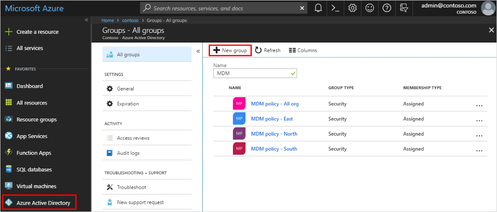
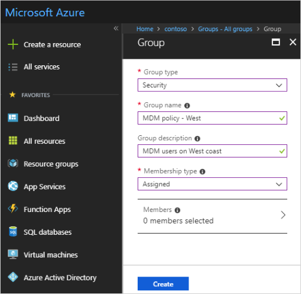
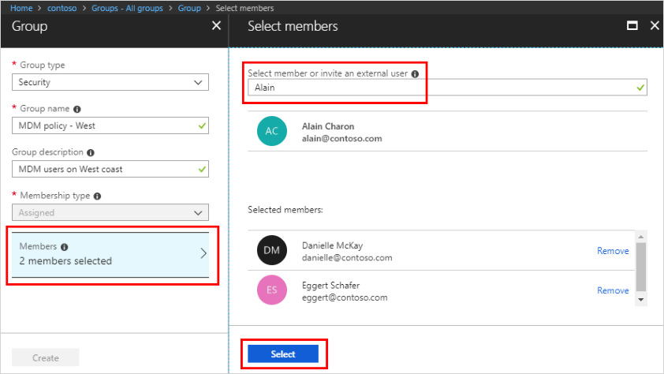
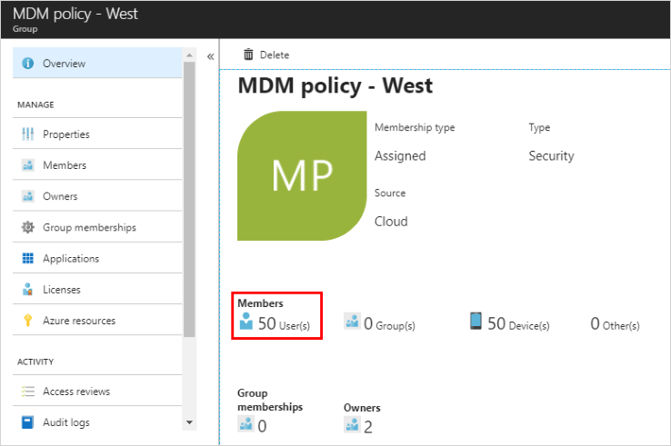

# Create a basic group and add members using Azure Active Directory
You can create a basic group using the Azure Active Directory (Azure AD) portal. For the purposes of this article, a basic group is added to a single resource by the resource owner (administrator) and includes specific members (employees) that need to access that resource. For more complex scenarios, including dynamic memberships and rule creation, see the [Azure Active Directory user management documentation](../users-groups-roles/index.yml).

## Create a basic group and add members
You can create a basic group and add your members at the same time.

### To create a basic group and add members
1. Sign in to the [Azure portal](https://portal.azure.com) using a Global administrator account for the directory.

2. Select **Azure Active Directory**, **Groups**, and then select **New group**.

    

3. In the **Group** page, fill out the required information.

    

    - **Group type (required).** Select a pre-defined group type. This includes:
        
        - **Security**. Used to manage member and computer access to shared resources for a group of users. For example, you can create a security group for a specific security policy. By doing it this way, you can give a set of permissions to all the members at once, instead of having to add permissions to each member individually. For more info about managing access to resources, see [Manage access to resources with Azure Active Directory groups](active-directory-manage-groups.md).
        
        - **Office 365**. Provides collaboration opportunities by giving members access to a shared mailbox, calendar, files, SharePoint site, and more. This option also lets you give people outside of your organization access to the group. For more info about Office 365 Groups, see [Learn about Office 365 Groups](https://support.office.com/article/learn-about-office-365-groups-b565caa1-5c40-40ef-9915-60fdb2d97fa2).

    - **Group name (required).** Add a name for the group, something that you'll remember and that makes sense.

    - **Group description.** Add an optional description to your group.

    - **Membership type (required).** Select a pre-defined membership type. This includes:

        - **Assigned.** Lets you add specific users to be members of this group and to have unique permissions. For the purposes of this article, we're using this option.

        - **Dynamic user.** Lets you use dynamic group rules to automatically add and remove members. If a member's attributes change, the system looks at your dynamic group rules for the directory to see if the member meets the rule requirements (is added) or no longer meets the rules requirements (is removed).

        - **Dynamic device.** Lets you use dynamic group rules to automatically add and remove devices. If a device's attributes change, the system looks at your dynamic group rules for the directory to see if the device meets the rule requirements (is added) or no longer meets the rules requirements (is removed).

        >[!Important]
        >You can create a dynamic group for either devices or users, but not for both. You also can't create a device group based on the device owners' attributes. Device membership rules can only reference device attributions. For more info about creating a dynamic group for users and devices, see [Create a dyncamic group and check status](../users-groups-roles/groups-create-rule.md).

4. Select **Create**.

    Your group is created and ready for you to add members.

5. Select the **Members** area from the **Group** page, and then begin searching for the members to add to your group from the **Select members** page.

    

6. When you're done adding members, choose **Select**.

    The **Group Overview** page updates to show the number of members who are now added to the group.

    

## Next steps
Now that you've added a group and at least one user, you can:

- [View your groups and members](active-directory-groups-view-azure-portal.md)

- [Manage group membership](active-directory-groups-membership-azure-portal.md)

- [Manage dynamic rules for users in a group](../users-groups-roles/groups-create-rule.md)

- [Edit your group settings](active-directory-groups-settings-azure-portal.md)

- [Manage access to resources using groups](active-directory-manage-groups.md)

- [Manage access to SaaS apps using groups](../users-groups-roles/groups-saasapps.md)

- [Manage groups using PowerShell commands](../users-groups-roles/groups-settings-v2-cmdlets.md)

- [Associate or add an Azure subscription to Azure Active Directory](active-directory-how-subscriptions-associated-directory.md)