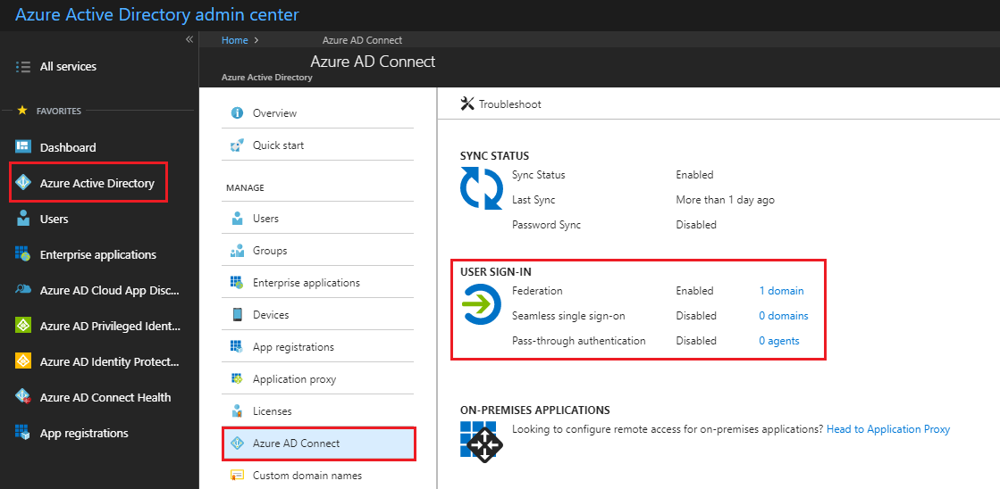
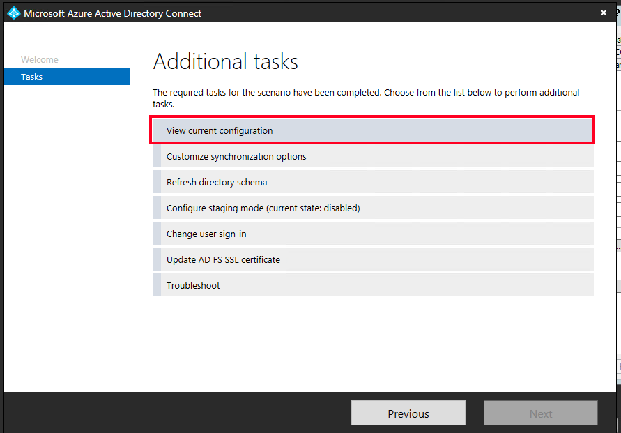
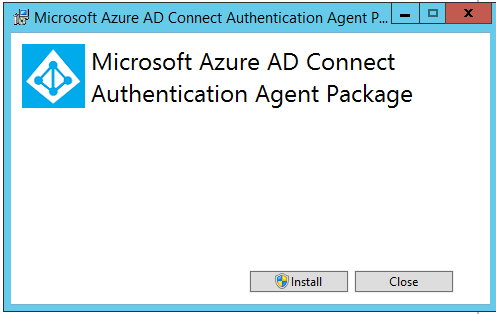
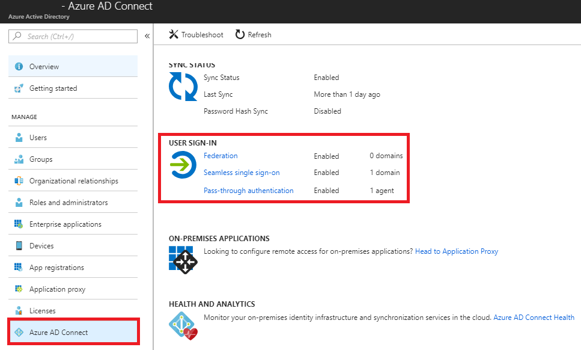
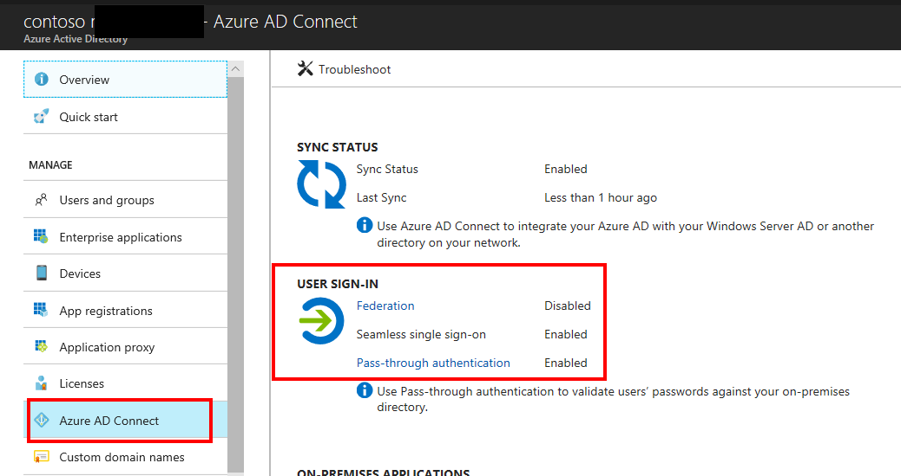
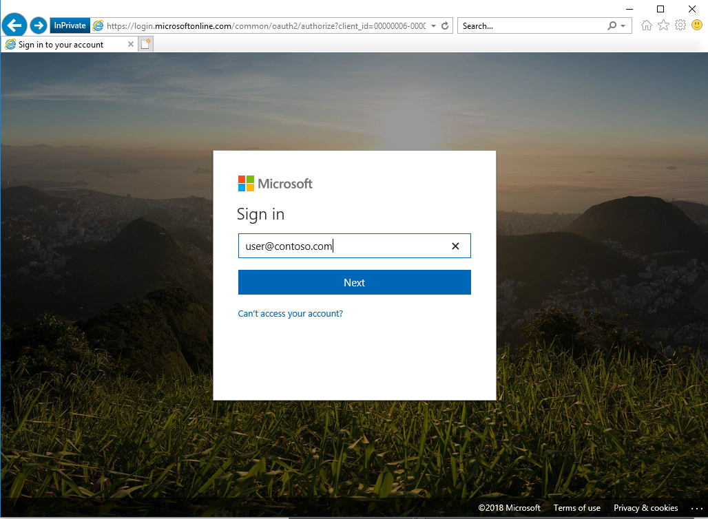
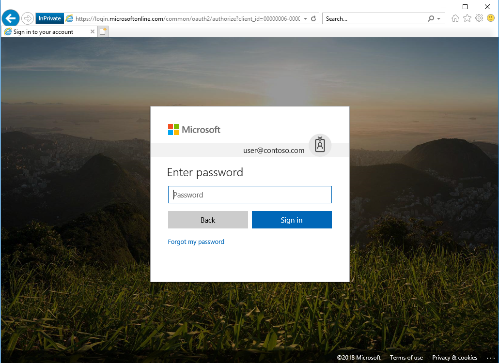
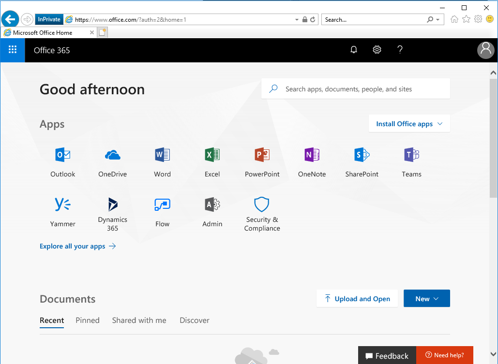
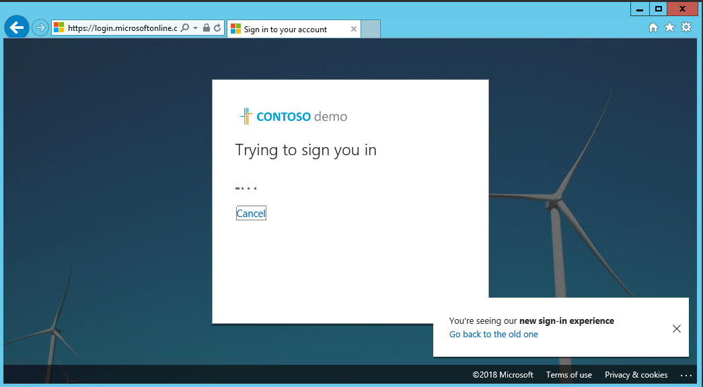

# Migrate from federation to pass-through authentication for Azure AD
The following document provides guidance on moving from AD FS to pass-through authentication.

>[!NOTE]
>A downloadable a copy of this document is available [here](https://aka.ms/ADFSTOPTADPDownload).

## Prerequisites for pass-through authentication
The following prerequisites are required before you can migrate.
### Update Azure AD Connect

As a minimum to successfully perform the steps to migrate to pass-through authentication, you should have [Azure AD connect](https://www.microsoft.com/download/details.aspx?id=47594) 1.1.819.0. This version contains significant changes to the way sign-in conversion is performed and reduces the overall time to migrate from Federation to Cloud Authentication from potentially hours to minutes.

> [!IMPORTANT]
> Outdated documentation, tools and blogs indicate that user conversion is a required step when converting domains from Federated to Managed. **Converting users** is not required anymore and Microsoft is working on updating documentation and tools to reflect this.

To update Azure AD Connect to the latest version following this [update instructions](https://docs.microsoft.com/azure/active-directory/connect/active-directory-aadconnect-upgrade-previous-version).

### Plan authentication agent number and placement

Pass-through Authentication is accomplished by deploying light-weight agents on the Azure AD Connect Server, and on your on-premises Windows Servers. Install the agents as close as possible to your Active Directory Domain Controllers to reduce latency.

For most customers two or three authentication agents are enough for high availability and capacity, and a tenant can have no more than 12 agents registered. The first agent is always installed on the AAD Connect server itself. Refer to the [information on network traffic estimations and performance guidance](https://docs.microsoft.com/azure/active-directory/connect/active-directory-aadconnect-pass-through-authentication-current-limitations) to understand the agent limitations and agent deployment options.

### Plan migration method

There are two methods to migrate from federated authentication to PTA and Seamless SSO. The method you use will depend on how your AD FS was originally configured.

- **Using Azure AD Connect**. If AD FS was originally configured using Azure AD Connect, then the change to Pass-through Authentication *must* be performed through the Azure AD Connect wizard.

‎When using Azure AD Connect, it runs the Set-MsolDomainAuthentication cmdlet for you automatically when you change the user sign-in method, and hence you have no control over it unfederating all of the verified federated domains in your Azure AD tenant.  
‎  
> [!NOTE]
> At this time, you cannot avoid un-federating all domains in your tenant when you change the user sign-in to Pass-through Authentication when AAD Connect was originally used to configure AD FS for you.  
‎
- **Using Azure AD Connect with PowerShell**. This method may be used only when AD FS was not originally configured with Azure AD Connect. You still need to change the user sign-in method via the Azure AD Connect wizard, but the core difference is that it will not automatically run the Set-MsolDomainAuthentication cmdlet for you as it has no awareness of your AD FS farm, and hence you have full control over which domains are converted and in which order.

To understand what method you should use, perform the steps on the following section.

#### Verify current user sign-in settings

Verify your current user sign-in settings by logging into the Azure AD portal [https://aad.portal.azure.com](https://aad.portal.azure.com/) with a Global Administrator account. 

In the **User Sign In** section, verify that **Federation** is **Enabled** and that **Seamless Single Sign-on** and **Pass-through Authentication** are **Disabled**. 



#### Verify how federation was configured

   1. Go to your Azure AD Connect server and launch Azure AD Connect, then select **Configure**.
   2. On the **Additional Tasks** screen, select **View Current Configuration** and then select **Next**.</br>
   </br>
   3. In the **Review Your Solution** screen, scroll down to **Active Directory Federation Services (AD FS)**.</br>
   ‎If you see that the AD FS configuration is in this section then you can safely assume AD FS was originally configured through Azure AD Connect and hence the conversion of your domain(s) from federated to managed can be driven through the Azure AD Connect **Change user sign-in** option, this process is detailed in the section **Option 1: Configuring Pass-through Authentication by using Azure AD Connect**.  
‎
   4. If you can’t see Active Directory Federation Services listed in the current settings, then you will need to manually convert the domains from federated to managed via PowerShell that is detailed in the section **Option 2 - Switch from Federation to PTA using Azure AD Connect and PowerShell**.

### Document current federation settings

You can find the current federation setting by running the Get-MsolDomainFederationSettings cmdlet.

The command is:

``` PowerShell
Get-MsolDomainFederationSettings -DomainName YourDomain.extention | fl *
```

For example:

``` PowerShell
Get-MsolDomainFederationSettings -DomainName Contoso.com | fl *
```


Validate any settings that might have been customized to your Federation design and deployment documentation, specifically **PreferredAuthenticationProtocol**, **SupportsMfa**, and **PromptLoginBehavior**.

More information on what these settings do can be found below.

[Active Directory Federation Services prompt=login parameter support](https://docs.microsoft.com/windows-server/identity/ad-fs/operations/ad-fs-prompt-login)  
‎[Set-MsolDomainAuthentication](https://docs.microsoft.com/powershell/module/msonline/set-msoldomainauthentication?view=azureadps-1.0)

> [!NOTE]
> If the SupportsMfa value is currently set to "True" then this means you are using an On-Premises MFA solution to inject a 2nd factor challenge into the user authentication flow. This will no longer work for Azure AD authentication scenarios, and instead you will have to leverage the Azure MFA (cloud-based) service to perform the same function. Carefully evaluate your MFA requirements before moving forward and make sure you understand how to leverage Azure MFA, the licensing implications, and the end user registration process before converting your domains.

#### Backup federation settings

Although no changes will be made to other Relying Parties on your AD FS farm during this process, it is recommended to make sure you have a current valid backup of your AD FS farm that can be restored. You can do this using the free Microsoft [AD FS Rapid Restore Tool](https://docs.microsoft.com/windows-server/identity/ad-fs/operations/ad-fs-rapid-restore-tool). This tool can be used to backup and restore AD FS, either to an existing farm, or a new farm.

If you choose not to use the AD FS Rapid Restore Tool, then at a minimum, you should export the "Microsoft Office 365 Identity Platform" relying party trust and any associated custom claim rules you may have added. You can do this via the following PowerShell example

``` PowerShell
(Get-AdfsRelyingPartyTrust -Name "Microsoft Office 365 Identity Platform") | Export-CliXML "C:\temp\O365-RelyingPartyTrust.xml"
```

## Deployment considerations and AD FS usage

### Validate your current AD FS usage

Before converting from Federated to Managed, you should look closely at how you are using AD FS today for Azure AD/Office 365 and other applications (relying party trusts). Specifically, you should consider the following table:

| If| Then |
|-|-|
| You are going to retain AD FS for those other applications.| You will be using both AD FS and Azure AD and will need to consider the end-user experience as a result. Users may need to authenticate twice in some scenarios, once to Azure AD (where they will get SSO onwards to other applications like Office 365) and again for any applications still bound to AD FS as a relying party trust. |
| AD FS is heavily customized and reliant on specific customization settings in the onload.js file that cannot be duplicated in Azure AD (for example, you have changed the sign-in experience so that users only enter a SamAccountName format for their username as opposed to a UPN, or have a heavily branded the login experience)| You will need to verify that your current customization requirements can be met by Azure AD before proceeding. Refer to the AD FS Branding and AD FS Customization sections for further information and guidance.|
| You are blocking legacy authentication clients via AD FS.| Consider replacing the controls to block legacy authentication clients currently present on AD FS with a combination of [Conditional Access controls for Legacy Authentication](https://docs.microsoft.com/azure/active-directory/conditional-access/conditions) and [Exchange Online Client Access Rules](http://aka.ms/EXOCAR). |
| You require users to perform MFA against an on-premises MFA server solution when authenticating to AD FS.| You won't be able to inject an MFA challenge via the on-premises MFA solution into the authentication flow for a managed domain, however you can use the Azure MFA service to do so going forward once the domain is converted. If users are not using Azure MFA today, then this will involve a onetime end-user registration step that you will have to prepare for and communicate to your end users. |
| You use Access Control Policies (AuthZ rules) today in AD FS to control access to Office 365.| Consider replacing these with the equivalent Azure AD [Conditional Access Policies](https://docs.microsoft.com/azure/active-directory/active-directory-conditional-access-azure-portal) and [Exchange Online Client Access Rules](http://aka.ms/EXOCAR).|

### Considerations for common AD FS customizations

#### Inside corporate network claim

The InsideCorporateNetwork claim is issued by AD FS if the user authenticating is inside the corporate network. This claim can then be passed on to Azure AD and used to bypass Multi-Factor authentication based on the users’ network location. See [Trusted IPs for Federated Users](https://docs.microsoft.com/azure/multi-factor-authentication/multi-factor-authentication-get-started-adfs-cloud) for information on how to determine if you have this currently enabled in AD FS.

The InsideCorporateNetwork claim won’t be available anymore once your domains are converted to Pass-through Authentication. [Named Locations in Azure AD](https://docs.microsoft.com/azure/active-directory/active-directory-named-locations) can be used to replace this functionality.

Once Named Locations have been configured, all Conditional Access policies configured to include or exclude the network locations "All trusted locations" or "MFA Trusted IPs" must be updated to reflect the newly created Named Locations.

See [Active Directory Conditional Access Locations](https://docs.microsoft.com/azure/active-directory/active-directory-conditional-access-locations) for more information on the Location condition in Conditional Access.

#### Hybrid Azure AD Joined devices

Joining a device to Azure AD enables you to create conditional access rules that enforce devices meeting your access standards for security and compliance and allows users to sign in to a device using an organizational work or school account instead of a personal account. Hybrid Azure AD Joined Devices enables you to join your AD domain-joined devices to Azure AD. Your federated environment may have been configured with this feature.

To ensure Hybrid Join continues working for any new devices joined to the domain once your domains have been converted to Pass-through Authentication, Azure AD Connect must be configured to synchronize Active Directory computer accounts for Windows 10 clients to Azure AD. For Windows 7 and Windows 8 computer accounts, Hybrid Join will use Seamless SSO to register the computer in Azure AD and you do not have to sync them as you do for Windows 10 devices. You will however have to deploy an updated workplacejoin.exe file (via an .msi) to these down-level clients so they can register themselves using Seamless SSO. [Download the .msi](https://www.microsoft.com/download/details.aspx?id=53554).

For more information on this requirement, see [How to configure hybrid Azure Active Directory joined devices](https://docs.microsoft.com/azure/active-directory/device-management-hybrid-azuread-joined-devices-setup)

#### Branding

Your organization may have [customized your ADFS sign-in pages](https://docs.microsoft.com/windows-server/identity/ad-fs/operations/ad-fs-user-sign-in-customization) to display information more pertinent to the organization. If so, consider making similar [customizations to the Azure AD sign-in page](https://docs.microsoft.com/azure/active-directory/customize-branding).

While similar customizations are available, some visual changes should be expected. You may want to include expected changes in your communications to end users.

> [!NOTE]
> Company branding is available only if you purchased the Premium or Basic license for Azure AD or have an Office 365 license.

## Planning for smart lockout

Azure AD smart lockout protects against brute-force password attacks and prevents the on-premises Active Directory account from being locked out when Pass-through Authentication is being used and an account lockout group policy is set in Active Directory. 

For more information on [Smart Lockout feature and how to edit its configuration](https://docs.microsoft.com/azure/active-directory/connect/active-directory-aadconnect-pass-through-authentication-smart-lockout).

## Planning deployment and support

### Plan the maintenance window

While the domain conversion process itself is relatively quick, Azure AD might still send some authentication requests to your AD FS servers for a period of up to 4 hours after the domain conversion has finished. During this four hour window, and depending on various service side caches, these authentications might not be accepted by Azure AD and users will receive an error as they will be able to authenticate successfully against AD FS still, but Azure AD will no longer accept a user’s issued token as that federation trust is now removed.

> [!NOTE]
> This will only impact users who access the services via a browser during this post conversion window until the service side cache is cleared. Legacy clients (Exchange ActiveSync, Outlook 2010/2013) should not be impacted as Exchange Online keeps a cache of their credentials for a period of time that is used to re-authenticate the user silently without needing to go back to AD FS. Credentials stored on the device for these clients are used to re-authenticate themselves silently once this cached is cleared and hence users should not receive any password prompts as a result of the domain conversion process. Conversely, for Modern Authentication clients (Office 2013/2016, IOS, and Android Apps) these use a valid Refresh Token to obtain new access tokens for continued access to resources instead of going back to AD FS, and hence are immune to any password prompts as a result of the domain conversion process and will continue to function without any extra configuration required.
> [!IMPORTANT]
> Don’t shut down your AD FS environment or remove the Office 365 relying party trust until you have verified all users are successfully authenticating using cloud authentication.

### Plan for rollback

If a major issue is found and cannot be resolved quickly, you might decide to roll back the solution back to Federation. It’s important to plan what to do if your deployment doesn’t go as planned. If the conversion of the domain or users fails during the deployment, or you need to rollback to federation, then you must understand how to mitigate any outage and reduce the impact to your users.

#### Rolling back

Consult your Federation design and deployment documentation for your particular deployment details. The process should involve:

* Convert Managed domains to federated using Convert-MSOLDomainToFederated 

* If necessary, configuring additional claims rules.

### Plan change communications

An important part of planning deployment and support is ensuring that your end users are proactively informed about the changes and what they may experience or must do. 

After both Pass-through Authentication and Seamless SSO are deployed, the end-user sign-in experience will change when accessing Office 365 and other associated resources authenticated through Azure AD. Users external to the network will now see the Azure AD sign-in page only, as opposed to being redirected to the forms-based page presented by the external facing Web Application Proxy servers.

There are multiple elements to planning your communication strategy. These include:

* Notifying users of upcoming and released functionality via
  * Email and other internal communication channels
  * Visuals such as posters
  * Executive live or other communications
* Determining who will customize and who will send the communications, and when.

## Implementing your solution

Now that you have planned your solution, you are ready to implement it. Implementation includes the following components:

   1. Preparing for Seamless Single Sign on
   2. Changing sign-in method Pass-through Authentication and enabling Seamless SSO

## Step 1 – Prepare for seamless SSO

To your devices to use Seamless SSO, you need to add an Azure AD URL to the users' Intranet zone settings by using Group Policy in Active Directory.

By default, the browser automatically calculates the correct zone, either Internet or Intranet, from a specific URL. For example, "http://contoso/" maps to the Intranet zone, whereas "http://intranet.contoso.com/" maps to the Internet zone (because the URL contains a period). Browsers will not send Kerberos tickets to a cloud endpoint, like the Azure AD URL, unless you explicitly add the URL to the browser's Intranet zone.

Follow the [steps to roll out](https://docs.microsoft.com/azure/active-directory/connect/active-directory-aadconnect-sso-quick-start) the required changes to your devices.

> [!IMPORTANT]
> Making this change won’t modify the way your users sign in to Azure AD. However, it’s important this configuration is applied to all your devices before you continue with the Step 3 Also note that users signing in on devices that have not received this configuration will simply need to enter username and password to sign in to Azure AD.

## Step 2 – Change sign-in method to PTA and enable seamless SSO

### Option A: Configuring PTA by using Azure AD Connect

Use this method when your AD FS was initially configured using Azure AD Connect. You cannot use this method if your AD FS was not originally configured using Azure AD Connect.

> [!IMPORTANT]
> Remember that by following the steps below all your domains will be converted from Federated to Managed. Review the section Plan Migration Method for more information.[](#_Plan_Migration_Method)

First you have to change sign-on method:

   1. On the Azure AD Connect Server, open the wizard.
   2. Select **Change User Sign in** and then select **Next**. 
   3. In the **Connect to Azure AD** screen provide the username and password of a Global Administrator.
   4. The **User Sign-in** screen, change the radio button from **Federation with AD FS** to **Pass-through Authentication**, select **Enable single sign-on** then select **Next**.
   5. In Enable Single Sign-on screen, enter the credentials of Domain Administrator account, then select Next.  

   > [!NOTE]
   > Domain Administrator credentials are required for enabling Seamless Single Sign-on as the process performs the following actions which require these elevated permissions. The domain administrator credentials are not stored in Azure AD Connect or in Azure AD. They're used only to enable the feature and then discarded after successful completion
   >
   > * A computer account named AZUREADSSOACC (which represents Azure AD) is created in your on-premises Active Directory (AD).
   > * The computer account's Kerberos decryption key is shared securely with Azure AD.
   > * In addition, two Kerberos service principal names (SPNs) are created to represent two URLs that are used during Azure AD sign-in.
   > * The domain administrator credentials are not stored in Azure AD Connect or in Azure AD. They're used only to enable the feature and then discarded after successful completion

   6. In the **Ready to Configure** screen, make sure **Start Synchronization process when configuration completes** checkbox is selected. Then select **Configure**.</br>
   </br>
   7. Open the **Azure AD portal**, select **Azure Active Directory**, and then select **Azure AD Connect**.
   8. Verify that **Federation is Disabled** while **Seamless single sign on** and **Pass-thorough authentication** are **Enabled**.</br>
   </br>

Next you must deploy additional authentication methods. Open the **Azure portal**, browse to **Azure Active Directory, Azure AD Connect** and click **Pass-through Authentication**.

From the **Pass-through Authentication** page, click on the Download button. From the **Download** Agent screen, click on **Accept terms and download**.

The download of additional authentication agents will begin. Install the secondary Authentication Agent on a domain-joined server. 

> [!NOTE]
> The first agent is always installed on the Azure AD Connect server itself as part of the configuration changes made in the User Sign In section of the Azure AD Connect tool. Any additional Authentication Agents should be installed on a separate server. It is recommended to have between 2-3 additional Authentication Agents available. 

Run the Authentication Agent installation. During the installation, you will need to provide credentials of a **Global Administrator** account.




Once the Authentication Agent is installed, you can go back to the Pass-through Authentication Agent health page to check the status of the additional agents.


Go to Testing and Next Steps.

> [!IMPORTANT]
> Skip the section Option B: Switch from Federation to PTA by using Azure AD Connect and PowerShell as the steps in that section do not apply.  

### Option B - Switch from federation to PTA using Azure AD Connect and PowerShell

Use this option when your federation was not initially configured by using Azure AD Connect. First you must enable Pass-through authentication:

   1. On the Azure AD Connect Server, open the wizard.
   2. Select **Change User Sign in** and then select **Next**.
   3. In the **Connect to Azure AD** screen provide the username and password of a Global Administrator.
   4. On the **User Sign-in** screen, change the radio button from **Do not configure** to **Pass-through Authentication**, select **Enable single sign-on** then select **Next**.
   5. In **Enable Single Sign-on** screen, enter the credentials of Domain Administrator account, then select **Next**.

   > [!NOTE]
   > Domain Administrator credentials are required for enabling Seamless Single Sign-on as the process performs the following actions which require these elevated permissions. The domain administrator credentials are not stored in Azure AD Connect or in Azure AD. They're used only to enable the feature and then discarded after successful completion.
   >
   > * A computer account named AZUREADSSOACC (which represents Azure AD) is created in your on-premises Active Directory (AD).
   > * The computer account's Kerberos decryption key is shared securely with Azure AD.
   > * In addition, two Kerberos service principal names (SPNs) are created to represent two URLs that are used during Azure AD sign-in.

   6. In the **Ready to Configure** screen, make sure **Start Synchronization process when configuration completes** checkbox is selected. Then select **Configure**.</br>
   ‎</br>
   The following steps occur when selecting Configure:
   * The first Pass-through Authentication Agent is installed
   * The Pass-through feature is enabled
   * Seamless Single Sign-On is enabled.  
   7. Verify that **Federation** is still **Enabled** and **Seamless single sign-on** and **Pass-thorough authentication** are now Enabled.
   
   8. Select **Pass-through Authentication** and verify that the status is **Active**.</br>
   
   If the Authentication Agent is not active, follow [these troubleshooting steps](https://docs.microsoft.com/azure/active-directory/connect/active-directory-aadconnect-troubleshoot-pass-through-authentication) before proceeding with the domain conversation process in the next step. You risk causing an authentication outage if you convert your domains prior to validating that your PTA agents have installed successfully and that their status shows as "Active" in the Azure portal.  
   9. Next deploy additional authentication agents. Open the **Azure portal**, browse to **Azure Active Directory**, **Azure AD Connect** and click **Pass-through Authentication**.
   10. From the **Pass-through Authentication** page, click on the **Download** button. From the **Download Agent** screen, click on **Accept terms and download**.
   
   The download of additional authentication agents will begin. Install the secondary Authentication Agent on a domain-joined server.

  > [!NOTE]
  > The first agent is always installed on the Azure AD Connect server itself as part of the configuration changes made in the User Sign In section of the Azure AD Connect tool. Any additional Authentication Agents should be installed on a separate server. It is recommended to have between 2-3 additional Authentication Agents available.
  
   11. Run the Authentication Agent installation. During the installation, you will need to provide credentials of a **Global Administrator** account.</br>
   </br>
   </br>
   12. Once the Authentication Agent is installed, you can go back to the Pass-through Authentication Agent health page to check the status of the additional agents.

At this point, Federation is still enabled and operational for your domains. To continue with the deployment, each domain needs to be converted from Federated to Managed so Pass-through Authentication starts serving authentication requests for the domain.

Not all domains need the be converted at the same time, you might choose to start with a test domain on your production tenant or the domain with the least number of users.

The conversion is performed using the Azure AD PowerShell Module.

   1. Open **PowerShell** and login to Azure AD using a **Global Administrator** account.
   2. To convert the first domain, run the following command:
 
 ``` PowerShell
 Set-MsolDomainAuthentication -Authentication Managed -DomainName <domainname>
 ```
 
   3. Open the **Azure AD portal**, select **Azure Active Directory**, and then select **Azure AD Connect**.  
   4. Once you have converted all your federated domains, verify that **Federation is Disabled** while **Seamless single sign-on** and **Pass-through authentication** are **Enabled**.</br>
   </br>

## Testing and next steps

### Test Pass-through authentication 

When your tenant was using federation, users were getting redirected from the Azure AD sign-in page to your AD FS environment. Now that the tenant is configured to use Pass-through Authentication instead of federation, users will not get redirected to AD FS and instead will sign in directly through the Azure AD sign-in page.

Open Internet Explorer in InPrivate mode to avoid Seamless SSO signing you in automatically and go to the Office 365 login page ([http://portal.office.com](http://portal.office.com/)). Type the **UPN** of your user and click **Next**. Make sure to type UPN of a hybrid user that was synced from your on-premises Active Directory and who was previously federated. The user will see the screen to type in their username and password.





Once you type the password, you should get redirected to the Office 365 portal.



### Test seamless single sign-on

   1. Login to a domain joined machine that is connected to the corporate network. 
   2. Open **Internet Explorer** or **Chrome** and go to one of the following URLs:   
      ‎  
      ‎[https://myapps.microsoft.com/contoso.com](https://myapps.microsoft.com/contoso.com) [https://myapps.microsoft.com/contoso.onmicrosoft.com](https://myapps.microsoft.com/contoso.onmicrosoft.com) (replace Contoso with your domain).

      The user will be briefly redirected to the Azure AD sign-in page and see the message "Trying to sign you in" and should not be prompted for either a username or a password.</br>
   </br>
   3. Then, the user will get redirected and signed into the Access Panel successfully:

> [!NOTE]
> Seamless Single Sign-On works on Office 365 services that supports domain hint (for example, myapps.microsoft.com/contoso.com). The Office 365 portal (portal.office.com) currently doesn’t support domain hint and therefore it is expected that users will need to type their UPN. Once a UPN is entered, Seamless single sign on can retrieve the Kerberos ticket on behalf of the user and log them in without typing a password.
> [!TIP]
> Consider deploying [Azure AD Hybrid Join on Windows 10](https://docs.microsoft.com/azure/active-directory/device-management-introduction) for an improved single sign-on experience.

### Removal of the relying party trust

Once you have validated that all users and clients are successfully authenticating via Azure AD, it can be considered safe to remove the Office 365 relying party trust.

If AD FS is not being used for other purposes (other Relying Party Trusts have been configured), it is safe to decommission AD FS now.

### Rollback

If a major issue is found and cannot be resolved quickly, you might decide to roll back the solution back to Federation.

Consult your Federation design and deployment documentation for your particular deployment details. The process should involve:

* Convert Managed domains to federated using Convert-MSOLDomainToFederated
* If necessary, configuring additional claims rules.

### Enable synchronization of userPrincipalName updates

Historically, updates to the UserPrincipalName attribute using the sync service from on-premises has been blocked, unless both of these conditions are true:

* The user is managed (non-federated).
* The user has not been assigned a license.

For instructions on how to verify or enable this feature, refer to the following article:

[Synchronize userPrincipalName updates](https://docs.microsoft.com/azure/active-directory/connect/active-directory-aadconnectsyncservice-features).

## Roll over the seamless SSO Kerberos decryption key

It is important to frequently roll over the Kerberos decryption key of the AZUREADSSOACC computer account (which represents Azure AD) created in your on-premises AD forest. We highly recommend that you roll over the Kerberos decryption key at least every 30 days to align with how Active Directory domain members submit password changes. As there is no associated device attached to the AZUREADSSOACC computer account object the rollover needs to be performed manually.

Follow these steps on the on-premises server where you are running Azure AD Connect to initiate the roll-over of the Kerberos decryption key.

[How can I roll over the Kerberos decryption key of the AZUREADSSOACC computer account](https://docs.microsoft.com/azure/active-directory/connect/active-directory-aadconnect-sso-faq)?

## Monitoring and logging

The servers running the Authentication Agents should be monitored to maintain the solution availability. In addition to general server performance counters, the Authentication Agents expose performance objects that can be used to understand authentication statistics and errors.

Authentication Agents log operations to Windows event logs under "Application and Service Logs\Microsoft\AzureAdConnect\AuthenticationAgent\Admin".

Troubleshooting logs can be enabled if necessary.

See more information about [monitoring and logging](https://docs.microsoft.com/azure/active-directory/connect/active-directory-aadconnect-troubleshoot-Pass-through-authentication).

## Next steps

- [Azure AD Connect design concepts](plan-connect-design-concepts.md)
- [Choose the right authentication](https://docs.microsoft.com/azure/security/azure-ad-choose-authn)
- [Supported topologies](plan-connect-design-concepts.md)
