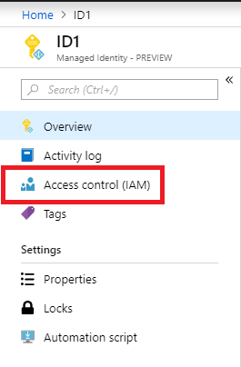
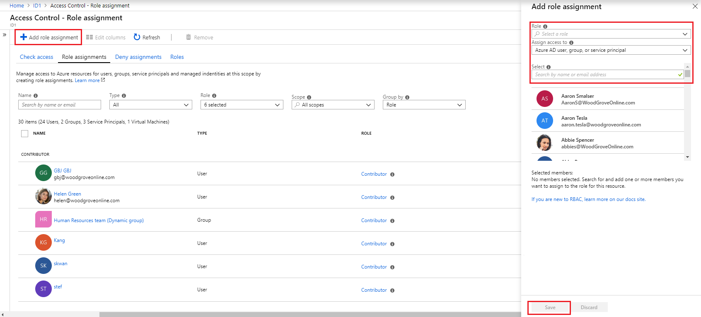

# Create, list, delete or assign a role to a user-assigned managed identity using the Azure portal

[!INCLUDE [preview-notice](~/includes/active-directory-msi-preview-notice-ua.md)]

Managed identities for Azure resources provides Azure services with a managed identity in Azure Active Directory. You can use this identity to authenticate to services that support Azure AD authentication, without needing credentials in your code. 

In this article, you learn how to create, list, delete or assign a role to a user-assigned managed identity using the Azure Portal.

## Prerequisites

- If you're unfamiliar with managed identities for Azure resources, check out the [overview section](overview.md). **Be sure to review the [difference between a system-assigned and user-assigned managed identity](overview.md#how-does-it-work)**.
- If you don't already have an Azure account, [sign up for a free account](https://azure.microsoft.com/free/) before continuing.

## Create a user-assigned managed identity

To create a user-assigned managed identity, your account needs the [Managed Identity Contributor](/azure/role-based-access-control/built-in-roles#managed-identity-contributor) role assignment.

1. Sign in to the [Azure portal](https://portal.azure.com) using an account associated with the Azure subscription to create the user-assigned managed identity.
2. In the search box, type *Managed Identities*, and under **Services**, click **Managed Identities**.
3. Click **Add** and enter values in the following fields under **Create user assigned managed** identity pane:
   - **Resource Name**: This is the name for your user-assigned managed identity, for example UAI1.
   - **Subscription**: Choose the subscription to create the user-assigned managed identity under
   - **Resource Group**: Create a new resource group to contain your user-assigned managed identity or choose **Use existing** to create the user-assigned managed identity in an existing resource group.
   - **Location**: Choose a location to deploy the user-assigned managed identity,for example **West US**.
4. Click **Create**.

## List user-assigned managed identities

To list/read a user-assigned managed identity, your account needs the [Managed Identity Operator](/azure/role-based-access-control/built-in-roles#managed-identity-operator) or [Managed Identity Contributor](/azure/role-based-access-control/built-in-roles#managed-identity-contributor) role assignment.

1. Sign in to the [Azure portal](https://portal.azure.com) using an account associated with the Azure subscription to list the user-assigned managed identities.
2. In the search box, type *Managed Identities*, and under Services, click **Managed Identities**.
3. A list of the user-assigned managed identities for your subscription is returned.  To see the details of a user-assigned managed identity click its name.

## Delete a user-assigned managed identity

To delete a user-assigned managed identity, your account needs the [Managed Identity Contributor](/azure/role-based-access-control/built-in-roles#managed-identity-contributor) role assignment.

1. Sign in to the [Azure portal](https://portal.azure.com) using an account associated with the Azure subscription to delete a user-assigned managed identity.
2. Select the user-assigned managed identity and click **Delete**.
3. Under the confirmation box choose, **Yes**.

## Assign a role to a user-assigned managed identity 

To assign a role to a user-assigned managed identity, your account needs the [User Access Administrator](/azure/role-based-access-control/built-in-roles#user-access-administrator) role assignment.

1. Sign in to the [Azure portal](https://portal.azure.com) using an account associated with the Azure subscription to list the user-assigned managed identities.
2. In the search box, type *Managed Identities*, and under Services, click **Managed Identities**.
3. A list of the user-assigned managed identities for your subscription is returned.  Select the user-assigned managed identity that you want to assign a role.
4. Select **Access control (IAM)** and then select **Add role assignment**.

   

5. In the Add role assignment blade, configure the following values and then click **Save**:
   - **Role** - the role to assign
   - **Assign access to**  - the resource to assign the user-assigned managed identity
   - **Select** - the member to assign access
   
     