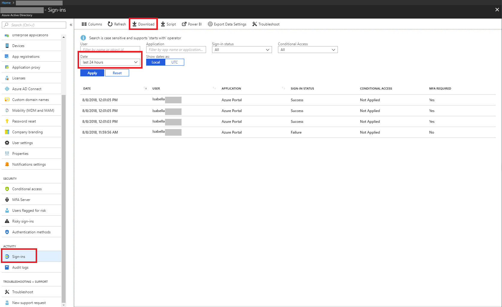

# Quickstart: Download a sign-in report using the Azure portal

In this quickstart, you learn how to download the sign-in data for your tenant for the past 24 hours.

## Prerequisites

You need:

* An Azure Active Directory tenant, with a Premium license to view the sign-in activity report. 
* A user, who is in the **Security Administrator**, **Security Reader**, **Report Reader** or **Global Administrator** role for the tenant. In addition, any user in the tenant can access their own sign-ins.

## Quickstart: Download a sign-in report

1. Navigate to the [Azure portal](https://portal.azure.com).
2. Select **Azure Active Directory** from the left navigation pane and use the **Switch directory** button to select your active directory.
3. From the dashboard, select **Azure Active Directory** and then select **Sign-ins**. 
4. Choose **last 24 hours** in the **Date** filter drop-down and select **Apply** to view the sign-ins for the past 24 hours. 
5. Select the **Download** button to download a CSV file containing the filtered records. 

## Next steps

* [Sign-in activity reports in the Azure Active Directory portal](concept-sign-ins.md)
* [Azure Active Directory reporting retention](reference-reports-data-retention.md)
* [Azure Active Directory reporting latencies](reference-reports-latencies.md)
