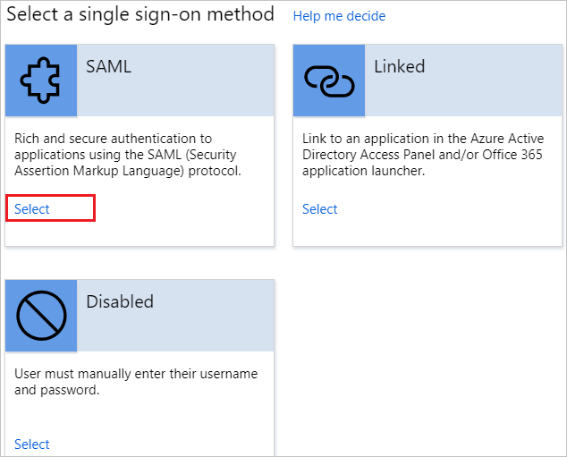
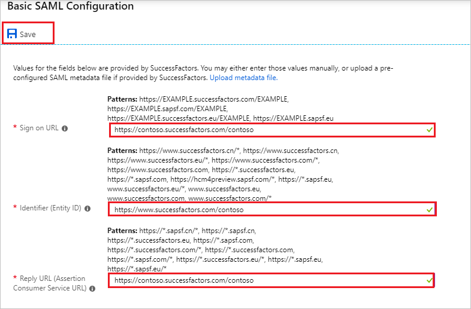

# Tutorial: Azure Active Directory integration with SuccessFactors

In this tutorial, you learn how to integrate SuccessFactors with Azure Active Directory (Azure AD).

Integrating SuccessFactors with Azure AD provides you with the following benefits:

- You can control in Azure AD who has access to SuccessFactors.
- You can enable your users to automatically get signed-on to SuccessFactors (Single Sign-On) with their Azure AD accounts.
- You can manage your accounts in one central location - the Azure portal.

If you want to know more details about SaaS app integration with Azure AD, see [what is application access and single sign-on with Azure Active Directory](../manage-apps/what-is-single-sign-on.md)

## Prerequisites

To configure Azure AD integration with SuccessFactors, you need the following items:

- An Azure AD subscription
- A SuccessFactors single sign-on enabled subscription

> [!NOTE]
> To test the steps in this tutorial, we do not recommend using a production environment.

To test the steps in this tutorial, you should follow these recommendations:

- Do not use your production environment, unless it is necessary.
- If you don't have an Azure AD trial environment, you can [get a one-month trial](https://azure.microsoft.com/pricing/free-trial/).

## Scenario description

In this tutorial, you test Azure AD single sign-on in a test environment. 
The scenario outlined in this tutorial consists of two main building blocks:

1. Adding SuccessFactors from the gallery
2. Configuring and testing Azure AD single sign-on

## Adding SuccessFactors from the gallery

To configure the integration of SuccessFactors into Azure AD, you need to add SuccessFactors from the gallery to your list of managed SaaS apps.

**To add SuccessFactors from the gallery, perform the following steps:**

1. In the **[Azure portal](https://portal.azure.com)**, on the left navigation panel, click **Azure Active Directory** icon. 

	![The Azure Active Directory button][1]

2. Navigate to **Enterprise applications**. Then go to **All applications**.

	![The Enterprise applications blade][2]

3. To add new application, click **New application** button on the top of dialog.

	![The New application button][3]

4. In the search box, type **SuccessFactors**, select **SuccessFactors** from result panel then click **Add** button to add the application.

	

## Configure and test Azure AD single sign-on

In this section, you configure and test Azure AD single sign-on with SuccessFactors based on a test user called "Britta Simon".

For single sign-on to work, Azure AD needs to know what the counterpart user in SuccessFactors is to a user in Azure AD. In other words, a link relationship between an Azure AD user and the related user in SuccessFactors needs to be established.

To configure and test Azure AD single sign-on with SuccessFactors, you need to complete the following building blocks:

1. **[Configuring Azure AD Single Sign-On](#configuring-azure-ad-single-sign-on)** - to enable your users to use this feature.
2. **[Creating an Azure AD test user](#creating-an-azure-ad-test-user)** - to test Azure AD single sign-on with Britta Simon.
3. **[Creating a SuccessFactors test user](#creating-a-successfactors-test-user)** - to have a counterpart of Britta Simon in SuccessFactors that is linked to the Azure AD representation of user.
4. **[Assigning the Azure AD test user](#assigning-the-azure-ad-test-user)** - to enable Britta Simon to use Azure AD single sign-on.
5. **[Testing single sign-on](#testing-single-sign-on)** - to verify whether the configuration works.

### Configuring Azure AD single sign-on

In this section, you enable Azure AD single sign-on in the Azure portal and configure single sign-on in your SuccessFactors application.

**To configure Azure AD single sign-on with SuccessFactors, perform the following steps:**

1. In the Azure portal, on the **SuccessFactors** application integration page, click **Single sign-on**.

	![Configure single sign-on link][4]

2. On the **Select a Single sign-on method** dialog, Click **Select** for **SAML** mode to enable single sign-on.

    

3. On the **Set up Single Sign-On with SAML** page, click **Edit** icon to open **Basic SAML Configuration** dialog.

	

4. On the **Basic SAML Configuration** section, perform the following steps:

	

    a. In the **Sign-on URL** textbox, type a URL using the following pattern:
    | |
    |--|
    | `https://<companyname>.successfactors.com/<companyname>`|
    | `https://<companyname>.sapsf.com/<companyname>`|
    | `https://<companyname>.successfactors.eu/<companyname>`|
    | `https://<companyname>.sapsf.eu`|

    b. In the **Identifier** textbox, type a URL using the following pattern:
    | |
    |--|
    | `https://www.successfactors.com/<companyname>`|
    | `https://www.successfactors.com`|
    | `https://<companyname>.successfactors.eu`|
    | `https://www.successfactors.eu/<companyname>`|
    | `https://<companyname>.sapsf.com`|
    | `https://hcm4preview.sapsf.com/<companyname>`|
    | `https://<companyname>.sapsf.eu`|
    | `https://www.successfactors.cn`|
    | `https://www.successfactors.cn/<companyname>`|

	c. In the **Reply URL** textbox, type a URL using the following pattern:
    | |
    |--|
    | `https://<companyname>.successfactors.com/<companyname>`|
    | `https://<companyname>.successfactors.com`|
    | `https://<companyname>.sapsf.com/<companyname>`|
    | `https://<companyname>.sapsf.com`|
    | `https://<companyname>.successfactors.eu/<companyname>`|
    | `https://<companyname>.successfactors.eu`|
    | `https://<companyname>.sapsf.eu`|
    | `https://<companyname>.sapsf.eu/<companyname>`|
    | `https://<companyname>.sapsf.cn`|
    | `https://<companyname>.sapsf.cn/<companyname>`|
    	 
	> [!NOTE] 
	> These values are not real. Update these values with the actual Sign-on URL, Identifier and Reply URL. Contact [SuccessFactors Client support team](https://www.successfactors.com/support.html) to get these values. 

5. On the **SAML Signing Certificate** page, in the **SAML Signing Certificate** section, click **Download** to download **Certificate (Base64)** and then save certificate file on your computer.

	 

6. On the **Set up SuccessFactors** section, copy the appropriate URL as per your requirement.

	a. Login URL

	b. Azure AD Identifier

	c. Logout URL

	

7. In a different web browser window, log in to your **SuccessFactors admin portal** as an administrator.
	
8. Visit **Application Security** and native to **Single Sign On Feature**. 

9. Place any value in the **Reset Token** and click **Save Token** to enable SAML SSO.
   
    ![Configuring single sign-on on app side][11]

    > [!NOTE] 
    > This value is used as the on/off switch. If any value is saved, the SAML SSO is ON. If a blank value is saved the SAML SSO is OFF.

10. Native to below screenshot and perform the following actions:
   
    ![Configuring single sign-on on app side][12]
   
    a. Select the **SAML v2 SSO** Radio Button
   
    b. Set the **SAML Asserting Party Name**(for example, SAML issuer + company name).
   
    c. In the **Issuer URL** textbox, paste the **Azure AD Identifier** value which you have copied from the Azure portal.
   
    d. Select **Assertion** as **Require Mandatory Signature**.
   
    e. Select **Enabled** as **Enable SAML Flag**.
   
    f. Select **No** as **Login Request Signature(SF Generated/SP/RP)**.
   
    g. Select **Browser/Post Profile** as **SAML Profile**.
   
    h. Select **No** as **Enforce Certificate Valid Period**.
   
    i. Copy the content of the downloaded certificate file from Azure portal, and then paste it into the **SAML Verifying Certificate** textbox.

    > [!NOTE] 
    > The certificate content must have begin certificate and end certificate tags.

11. Navigate to SAML V2, and then perform the following steps:
   
    ![Configuring single sign-on on app side][13]
   
    a. Select **Yes** as **Support SP-initiated Global Logout**.
   
    b. In the **Global Logout Service URL (LogoutRequest destination)** textbox, paste the **Sign-Out URL** value which you have copied form the Azure portal.
   
    c. Select **No** as **Require sp must encrypt all NameID element**.
   
    d. Select **unspecified** as **NameID Format**.
   
    e. Select **Yes** as **Enable sp initiated login (AuthnRequest)**.
   
    f. In the **Send request as Company-Wide issuer** textbox, paste **SAML Single Sign-On Service URL** value which you have copied from the Azure portal.

12. Perform these steps if you want to make the login usernames Case Insensitive.
   
	![Configure Single Sign-On][29]
	
	a. Visit **Company Settings**(near the bottom).
   
	b. select checkbox near **Enable Non-Case-Sensitive Username**.
   
	c.Click **Save**.
   
	> [!NOTE] 
    > If you try to enable this, the system checks if it creates a duplicate SAML login name. For example if the customer has usernames User1 and user1. Taking away case sensitivity makes these duplicates. The system gives you an error message and does not enable the feature. The customer needs to change one of the usernames so it’s spelled different.

### Creating an Azure AD test user

The objective of this section is to create a test user in the Azure portal called Britta Simon.

1. In the Azure portal, in the left pane, select **Azure Active Directory**, select **Users**, and then select **All users**.

	![Create Azure AD User][100]

2. Select **New user** at the top of the screen.

	 

3. In the User properties, perform the following steps.

	

    a. In the **Name** field, enter **BrittaSimon**.
  
    b. In the **User name** field, type **brittasimon@yourcompanydomain.extension**  
    For example, BrittaSimon@contoso.com

    c. Select **Properties**, select the **Show password** check box, and then write down the value that's displayed in the Password box.

    d. Select **Create**.

### Creating a SuccessFactors test user

To enable Azure AD users to log in to SuccessFactors, they must be provisioned into SuccessFactors.  
In the case of SuccessFactors, provisioning is a manual task.

To get users created in SuccessFactors, you need to contact the [SuccessFactors support team](https://www.successfactors.com/support.html).

### Assigning the Azure AD test user

In this section, you enable Britta Simon to use Azure single sign-on by granting access to SuccessFactors.

1. In the Azure portal, select **Enterprise Applications**, select **All applications**.

	![Assign User][201]

2. In the applications list, select **SuccessFactors**.

	

3. In the menu on the left, click **Users and groups**.

	![Assign User][202]

4. Click **Add** button. Then select **Users and groups** on **Add Assignment** dialog.

	![Assign User][203]

5. In the **Users and groups** dialog select **Britta Simon** in the Users list, then click the **Select** button at the bottom of the screen.

6. In the **Add Assignment** dialog select the **Assign** button.

### Testing single sign-on

In this section, you test your Azure AD single sign-on configuration using the Access Panel.

When you click the SuccessFactors tile in the Access Panel, you should get automatically signed-on to your SuccessFactors application.
For more information about the Access Panel, see [Introduction to the Access Panel](../user-help/active-directory-saas-access-panel-introduction.md).

## Additional resources

* [List of Tutorials on How to Integrate SaaS Apps with Azure Active Directory](tutorial-list.md)
* [What is application access and single sign-on with Azure Active Directory?](../manage-apps/what-is-single-sign-on.md)

<!--Image references-->

[1]: common/tutorial_general_01.png
[2]: common/tutorial_general_02.png
[3]: common/tutorial_general_03.png
[4]: common/tutorial_general_04.png

[100]: common/tutorial_general_100.png

[201]: common/tutorial_general_201.png
[202]: common/tutorial_general_202.png
[203]: common/tutorial_general_203.png
[11]: ./media/successfactors-tutorial/tutorial_successfactors_07.png
[12]: ./media/successfactors-tutorial/tutorial_successfactors_08.png
[13]: ./media/successfactors-tutorial/tutorial_successfactors_09.png
[29]: ./media/successfactors-tutorial/tutorial_successfactors_10.png
