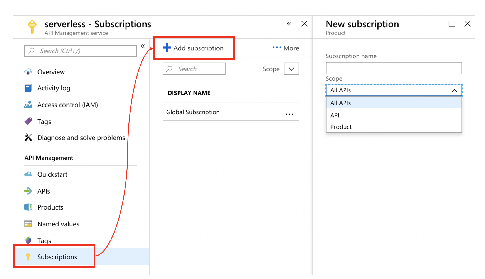

# Subscriptions in Azure API Management

Subscriptions is an important concept in Azure API Management (APIM). It is the most common way for API consumers to obtain access to APIs published through an APIM instance. This article provides an overview of the concept.

## What is Subscriptions

When publishing APIs through APIM, the easiest and most common way to secure access to those APIs is by using Subscription Keys. In other words, developers who need to consume the published APIs must include a valid Subscription Key in HTTP requests when making calls to those APIs. Otherwise, the calls are rejected immediately by the APIM gateway and are not forwarded to the backend services.

To obtain a Subscription Key for accessing APIs, a Subscription is required. Subscription is essentially a named container for a pair of Subscription Keys. Subscriptions can be obtained by developers who need to consume the published APIs, with or without approval by API publishers. API publishers can also create Subscriptions directly, on behalf of API consumers.

> [!TIP]
> APIM also supports other mechanisms for securing access to APIs including [OAuth2.0](api-management-howto-protect-backend-with-aad.md), [client certificates](api-management-howto-mutual-certificates-for-clients.md), and [IP whitelisting](https://docs.microsoft.com/azure/api-management/api-management-access-restriction-policies#RestrictCallerIPs)

## Scope of Subscriptions

Subscriptions can be associated with various scopes: Product, All APIs, or an individual API.

### Subscriptions for a product

Traditionally, Subscriptions in APIM were always associated with a single [API product](api-management-terminology.md) scope. Developers would find the list of products on the Developer Portal, and submit Subscription Requests for the products they would like to use. Once a Subscription Request is approved (either automatically or by API publishers), the developer can use the keys in it to access all APIs in the product.

> [!TIP]
> Under certain scenarios, API publishers may want to publish an API product to the public without the requirement of Subscriptions. They can un-check the **Require subscription** option in the **Settings** page of the product in the Azure portal. As a result, all APIs under the product can be accessed without an API key.

### Subscriptions for all APIs or an individual API

> [!NOTE]
> Currently, this feature is available in the API Management Consumption tier only.

When we introduced the [Consumption](https://aka.ms/apimconsumptionblog) tier of APIM, we made a few changes to streamline key management. First, we added two more subscription scopes - all APIs and a single API. The scope of Subscriptions is no longer limited to an API product. It is now possible to create keys granting access to an API (or all APIs within an APIM instance), without needing to create a product and add the APIs to it first. Moreover, each APIM instance now comes with an immutable, all-APIs Subscription, which makes it easier and more straightforward to test and debug APIs within the Test console.

Second, APIM now allows "standalone" Subscriptions. Subscriptions are no longer required to be associated with a developer account. This is useful in scenarios such as when a subscription is shared by multiple developers or teams.

Finally, API publishers can now [create Subscriptions](api-management-howto-create-subscriptions.md) directly in the Azure Portal:

## Next steps
For more information on API Management:

+ Learn other [concepts](api-management-terminology.md) in API Management
+ Follow our [tutorials](import-and-publish.md) to learn more about API Management
+ Check our [FAQ page](api-management-faq.md) for common questions