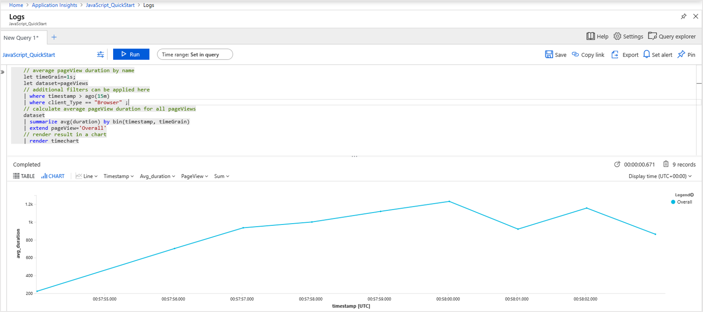

# Start monitoring your website

With Azure Monitor Application Insights, you can easily monitor your website for availability, performance, and usage. You can also quickly identify and diagnose errors in your application without waiting for a user to report them. Application Insights provides both server-side monitoring as well as client/browser-side monitoring capabilities.

This quickstart guides you through adding the [open source Application Insights JavaScript SDK](https://github.com/Microsoft/ApplicationInsights-JS) which allows you to understand the client/brower-side experience for visitors to your website.

## Prerequisites

To complete this quickstart:

- You need an Azure Subscription.

If you don't have an Azure subscription, create a [free](https://azure.microsoft.com/free/) account before you begin.

## Sign in to the Azure portal

Sign in to the [Azure portal](https://portal.azure.com/).

## Enable Application Insights

Application Insights can gather telemetry data from any internet-connected application, running on-premises or in the cloud. Use the following steps to start viewing this data.

1. Select **Create a resource** > **Management tools** > **Application Insights**.

   A configuration box appears; use the following table to fill out the input fields.

    | Settings        | Value           | Description  |
   | ------------- |:-------------|:-----|
   | **Name**      | Globally Unique Value | Name that identifies the app you are monitoring |
   | **Application Type** | General Application | Type of app you are monitoring |
   | **Resource Group**     | myResourceGroup      | Name for the new resource group to host App Insights data |
   | **Location** | East US | Choose a location near you, or near where your app is hosted |

2. Click **Create**.

## Create an HTML file

1. On your local computer, create a file called ``hello_world.html``. For this example the file will be placed on the root of the C: drive at ``C:\hello_world.html``.
2. Copy the script below into ``hello_world.html``:

    ```html
    <!DOCTYPE html>
    <html>
    <head>
    <title>Azure Monitor Application Insights</title>
    </head>
    <body>
    <h1>Azure Monitor Application Insights Hello World!</h1>
    <p>You can use the Application Insights JavaScript SDK to perform client/browser-side monitoring of your website. To learn about more advanced JavaScript SDK configurations visit the <a href="https://github.com/Microsoft/ApplicationInsights-JS/blob/master/API-reference.md" title="API Reference">API reference</a>.</p>
    </body>
    </html>
    ```

## Configure App Insights SDK

1. Select **Overview** > **Essentials** > Copy your application's **Instrumentation Key**.

   

2. Add the following script to your ``hello_world.html`` before the closing ``</head>`` tag:

   ```javascript
      <script type="text/javascript">
        var appInsights=window.appInsights||function(a){
            function b(a){c[a]=function(){var b=arguments;c.queue.push(function(){c[a].apply(c,b)})}}var c={config:a},d=document,e=window;setTimeout(function(){var b=d.createElement("script");b.src=a.url||"https://az416426.vo.msecnd.net/scripts/a/ai.0.js",d.getElementsByTagName("script")[0].parentNode.appendChild(b)});try{c.cookie=d.cookie}catch(a){}c.queue=[];for(var f=["Event","Exception","Metric","PageView","Trace","Dependency"];f.length;)b("track"+f.pop());if(b("setAuthenticatedUserContext"),b("clearAuthenticatedUserContext"),b("startTrackEvent"),b("stopTrackEvent"),b("startTrackPage"),b("stopTrackPage"),b("flush"),!a.disableExceptionTracking){f="onerror",b("_"+f);var g=e[f];e[f]=function(a,b,d,e,h){var i=g&&g(a,b,d,e,h);return!0!==i&&c["_"+f](a,b,d,e,h),i}}return c
        }({
            instrumentationKey: "xxxxxxxx-xxxx-xxxx-xxxx-xxxxxxxx"
        });
        
        window.appInsights=appInsights,appInsights.queue&&0===appInsights.queue.length&&appInsights.trackPageView();
</script>
   ```

3. Edit ``hello_world.html`` and add your instrumentation key.

4. Open ``hello_world.html`` in a local browser session. This will create a single pageview. You can refresh your browser to generate multiple test page views.

## Start monitoring in the Azure portal

1. You can now reopen the Application Insights **Overview** page in the Azure portal, where you retrieved your instrumentation key, to view details about your currently running application. The four default charts on the overview page are scoped to server-side application data. Since we are instrumenting the client/browser-side interactions with the JavaScript SDK this particular view doesn't apply unless we also have a server-side SDK installed.

2. Click on  **Analytics**.  This opens **Analytics**, which provides a rich query language for analyzing all data collected by Application Insights. To view data related to the client-side browser requests run the  following query:

    ```kusto
    // average pageView duration by name
    let timeGrain=1s;
    let dataset=pageViews
    // additional filters can be applied here
    | where timestamp > ago(15m)
    | where client_Type == "Browser" ;
    // calculate average pageView duration for all pageViews
    dataset
    | summarize avg(duration) by bin(timestamp, timeGrain)
    | extend pageView='Overall'
    // render result in a chart
    | render timechart
    ```

   

3. Go back to the **Overview** page. Click on **Browser** from under the **Investigate** header, then select **Performance**  Here you find metrics related to the performance of your website. There is also a corresponding view for analyzing failures and exceptions in your website. You can click **Samples** to drill into individual transaction details. From here, you can access the [end-to-end transaction details](app-insights-transaction-diagnostics.md) experience.

   

4. To begin exploring the [user behavior analytics tools](app-insights-usage-overview.md), from the main Application Insights menu select [**Users**](app-insights-usage-segmentation.md) under the **Usage** header. Since we are testing from a single machine, we will only see data for one user. For a live website, the distribution of users might look as follows:

     

5. If we had instrumented a more complex website with multiple pages, another useful tool is [**User Flows**](app-insights-usage-flows.md). With **User Flows** you can track the pathway visitors takes through the various parts of your website.

  

To learn more advanced configurations for monitoring websites, check out the [JavaScript SDK API reference](https://github.com/Microsoft/ApplicationInsights-JS/blob/master/API-reference.md).

## Clean up resources

If you plan to continue on to work with subsequent quickstarts or with the tutorials, do not clean up the resources created in this quickstart. Otherwise, if you do not plan to continue, use the following steps to delete all resources created by this quickstart in the Azure portal.

1. From the left-hand menu in the Azure portal, click **Resource groups** and then click **myResourceGroup**.
2. On your resource group page, click **Delete**, type **myResourceGroup** in the text box, and then click **Delete**.

## Next steps

> [!div class="nextstepaction"]
> [Find and diagnose performance problems](https://docs.microsoft.com/azure/application-insights/app-insights-analytics)
