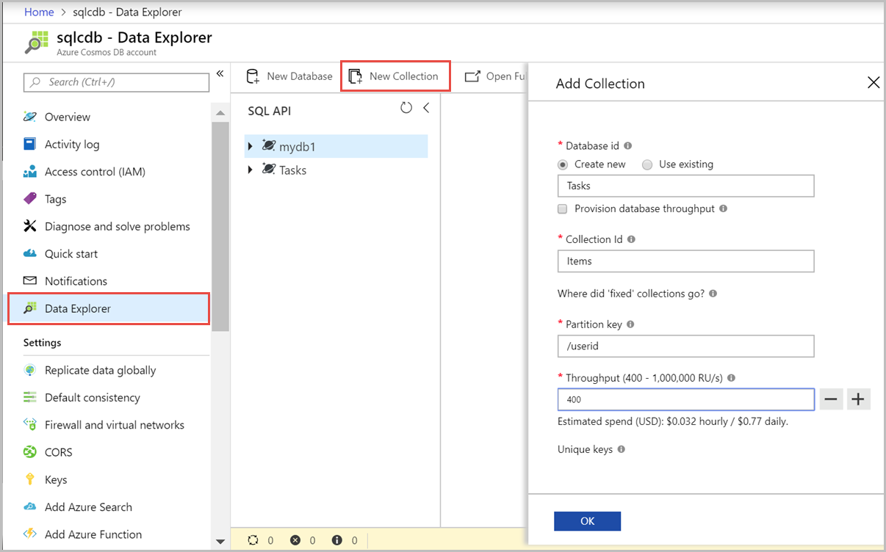
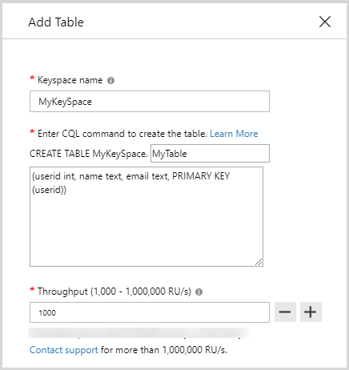
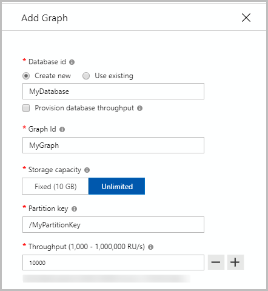

# Create a container in Azure Cosmos DB

This article explains the different ways to create a container (collection, table, graph). A container can be created by using the Azure portal, Azure CLI, or supported SDKs. This article demonstrates how to create a container, specify the partition key and provision throughput.

## Create a container using Azure portal

### <a id="portal-sql"></a>Azure Cosmos DB API for SQL (Core)

1. Sign in to [Azure portal](https://portal.azure.com/).

1. [Create a new Cosmos DB account](create-sql-api-dotnet.md#create-a-database-account) or select an existing account.

1. Open the **Data Explorer** pane and select **New Collection**. Next fill the form with the following details:

   * Create a new database or use an existing one.
   * Enter a Collection Id.
   * Enter a Partition key.
   * Enter a throughput, for example 1000 RUs.
   * Select **OK**.



### <a id="portal-mongodb"></a>Azure Cosmos DB API for MongoDB

1. Sign in to [Azure portal](https://portal.azure.com/).

1. [Create a new Cosmos DB account](create-mongodb-dotnet.md#create-a-database-account) or select an existing account.

1. Open the **Data Explorer** pane and select **New Collection**. Next fill the form with the following details:

   * Create a new database or use an existing one.
   * Enter a Collection Id.
   * Select **Unlimited** storage capacity.
   * Enter a Shard key.
   * Enter a throughput, for example 1000 RUs.
   * Select **OK**.


### <a id="portal-cassandra"></a>Azure Cosmos DB API for Cassandra

1. Sign in to [Azure portal](https://portal.azure.com/).

1. [Create a new Cosmos DB account](create-cassandra-dotnet.md#create-a-database-account) or select an existing account.

1. Open the **Data Explorer** pane and select **New Table**. Next fill the form with the following details:

   * Create a new Keyspace or use an existing one.
   * Enter a table name.
   * Enter the properties and specify a PRIMARY KEY.
   * Enter a throughput, for example 1000 RUs.
   * Select **OK**.



> [!NOTE]
> For Cassandra API, the primary key is used as the partition key.

### <a id="portal-gremlin"></a>Azure Cosmos DB API for Gremlin

1. Sign in to [Azure portal](https://portal.azure.com/).

1. [Create a new Cosmos DB account](create-graph-dotnet.md#create-a-database-account) or select an existing account.

1. Open the **Data Explorer** pane and select **New Graph**. Next fill the form with the following details:

   * Create a new database or use an existing one.
   * Enter a Graph id.
   * Select **Unlimited** storage capacity.
   * Enter a Partition key for vertices.
   * Enter a throughput, for example 1000 RUs.
   * Select **OK**.



### <a id="portal-table"></a>Azure Cosmos DB API for Table

1. Sign in to [Azure portal](https://portal.azure.com/).

1. [Create a new Cosmos DB account](create-table-dotnet.md#create-a-database-account) or select an existing account.

1. Open the **Data Explorer** pane and select **New Table**. Next fill the form with the following details:

   * Enter a Table Id.
   * Select **Unlimited** storage capacity.
   * Enter a throughput, for example 1000 RUs.
   * Select **OK**.


> [!Note]
> For Table API, the partition key is specified each time you add a new row.

## Create a container using Azure CLI

### <a id="cli-sql"></a>Azure Cosmos DB API for SQL (Core)

```azurecli-interactive
# Create a container with a partition key and provision 1000 RU/s throughput.

az cosmosdb collection create \
    --resource-group $resourceGroupName \
    --collection-name $containerName \
    --name $accountName \
    --db-name $databaseName \
    --partition-key-path /myPartitionKey \
    --throughput 1000
```

### <a id="cli-mongodb"></a>Azure Cosmos DB API for MongoDB

```azurecli-interactive
# Create a collection with a shard key and provision 1000 RU/s throughput.
az cosmosdb collection create \
    --resource-group $resourceGroupName \
    --collection-name $collectionName \
    --name $accountName \
    --db-name $databaseName \
    --partition-key-path /myShardKey \
    --throughput 1000
```

### <a id="cli-cassandra"></a>Azure Cosmos DB API for Cassandra

```azurecli-interactive
# Create a table with a partition/primary key and provision 1000 RU/s throughput.
az cosmosdb collection create \
    --resource-group $resourceGroupName \
    --collection-name $tableName \
    --name $accountName \
    --db-name $keyspaceName \
    --partition-key-path /myPrimaryKey \
    --throughput 1000
```

### <a id="cli-gremlin"></a>Azure Cosmos DB API for Gremlin

```azurecli-interactive
# Create a graph with a partition key and provision 1000 RU/s throughput.
az cosmosdb collection create \
    --resource-group $resourceGroupName \
    --collection-name $graphName \
    --name $accountName \
    --db-name $databaseName \
    --partition-key-path /myPartitionKey \
    --throughput 1000
```

### <a id="cli-table"></a>Azure Cosmos DB API for Table

```azurecli-interactive
# Create a table with 1000 RU/s
# Note: you don't need to specify partition key in the following command because the partition key is set on each row.
az cosmosdb collection create \
    --resource-group $resourceGroupName \
    --collection-name $tableName \
    --name $accountName \
    --db-name $databaseName \
    --throughput 1000
```

## Create a container using .NET SDK

### <a id="dotnet-sql-graph"></a>Azure Cosmos DB API for SQL and Gremlin

```csharp
// Create a container with a partition key and provision 1000 RU/s throughput.
DocumentCollection myCollection = new DocumentCollection();
myCollection.Id = "myContainerName";
myCollection.PartitionKey.Paths.Add("/myPartitionKey");

await client.CreateDocumentCollectionAsync(
    UriFactory.CreateDatabaseUri("myDatabaseName"),
    myCollection,
    new RequestOptions { OfferThroughput = 1000 });
```

### <a id="dotnet-mongodb"></a>Azure Cosmos DB API for MongoDB

```csharp
// Create a collection with a partition key by using Mongo Shell:
db.runCommand( { shardCollection: "myDatabase.myCollection", key: { myShardKey: "hashed" } } )
```

> [!Note]
> MongoDB does not have a concept of request units. To create a new collection with throughput, use the Azure Portal or SQL API as shown in the previous examples.

### <a id="dotnet-cassandra"></a>Azure Cosmos DB API for Cassandra

```csharp
// Create a Cassandra table with a partition/primary key and provision 1000 RU/s throughput.
session.Execute(CREATE TABLE myKeySpace.myTable(
    user_id int PRIMARY KEY,
    firstName text,
    lastName text) WITH cosmosdb_provisioned_throughput=1000);
```

## Next steps

See the following articles to learn about partitioning in Cosmos DB:

- [Partitioning in Azure Cosmos DB](partitioning-overview.md)
