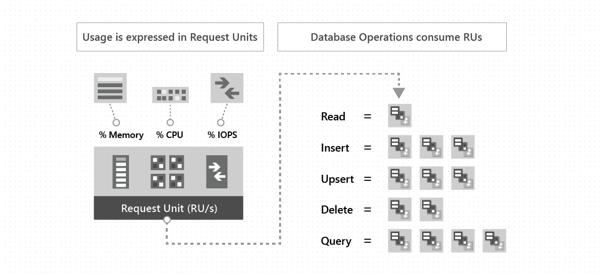

# Request units in Azure Cosmos DB

With Azure Cosmos DB, you pay for the throughput you provision and the storage you consume on an hourly basis. Throughput must be provisioned to ensure that sufficient system resources are available for your Azure Cosmos database all the time to meet or exceed the Azure Cosmos DB SLA.

Azure Cosmos DB supports a variety of APIs (SQL, MongoDB, Cassandra, Gremlin, and Table). Each API has its own set of database operations, ranging from simple point reads and writes to complex queries. Each database operation consumes system resources depending upon the complexity of the operation.  The cost of all database operations is normalized by Azure Cosmos DB and is expressed in terms of Request Units (RUs). The cost to read a 1-KB item is 1 Request Unit (1 RU) and minimum RUs required to consume 1 GB of storage is 40. All other database operations are similarly assigned a cost in terms of RUs. Regardless of the API you are using to interact with your Azure Cosmos container and the database operation (write, read, query), costs are always measured in terms of RUs.

You can think of RU/s as the currency for throughput. RU/s is a rate-based currency, which abstracts the system resources such as CPU, IOPS, and memory that are required to perform the database operations supported by Azure Cosmos DB. The following image shows the request units consumed by different database operations:

To manage and plan capacity, Azure Cosmos DB ensures that the number of RUs for a given database operation over a given dataset is deterministic. You can track the number of RUs that are consumed by any database operation by examining the response header. Once you understand the factors that affect request unit charges, and your application's throughput requirements, you can run your application cost-effectively.

While you are billed on an hourly basis, you provision the number of RUs for your application on a per-second basis in increments of 100 RU/s. To scale the provisioned throughput for your application, you can increase or decrease the number of RUs (in the increments or decrements of 100 RUs) at any time, either programmatically or by using the Azure portal.

You can provision throughput at two distinct granularities: 

* **Containers**. For more information, see [how to provision throughput on a Azure Cosmos container.](how-to-provision-container-throughput.md)
* **Databases**. For more information, see [how to provision throughput on a Azure Cosmos database.](how-to-provision-database-throughput.md)

## Request unit considerations

While estimating the number of RU/s to provision, it is important to consider the following factors:

* **Item size** - As the size of an item increases, the number of RUs consumed to read or write the item also increases.

* **Item indexing** - By default, each item is automatically indexed. Fewer request units are consumed if you choose not to index some of your items in a container.

* **Item property count** - Assuming the default indexing on all properties, the number of RUs consumed to write an item increases as the item property count increases.

* **Indexed properties** - An index policy on each container determines which properties are indexed by default. You can reduce the request unit consumption for write operations by limiting the number of indexed properties.

* **Data consistency** - The strong and bounded staleness consistency levels consume approximately 2X more RUs while performing read operations when compared to that of other relaxed consistency levels.

* **Query patterns** - The complexity of a query affects how many request units are consumed for an operation. The number of query results, the number of predicates, the nature of the predicates, the number of user-defined functions, the size of the source data, the size of the result set and projections affect the cost of query operations. Azure Cosmos DB guarantees that the same query on the same data will always cost the same number of RUs on repeat executions.

* **Script usage** - As with queries, stored procedures, and triggers consume RUs based on the complexity of the operations being performed. As you develop your application, inspect the request charge header to better understand how much request unit capacity each operation consumes.

## Next steps

* Learn more about [provisioning throughput for Azure Cosmos containers and databases](set-throughput.md)
* Learn more about [Logical partitions](partition-data.md)
* Learn more about [globally scaling provisioned throughput](scaling-throughput.md)
* Learn [how to provision throughput on a Azure Cosmos container](how-to-provision-container-throughput.md)
* Learn [how to provision throughput on a Azure Cosmos database](how-to-provision-database-throughput.md)
