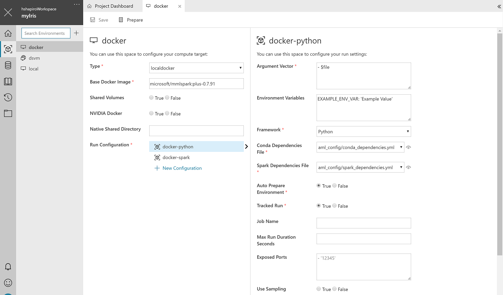
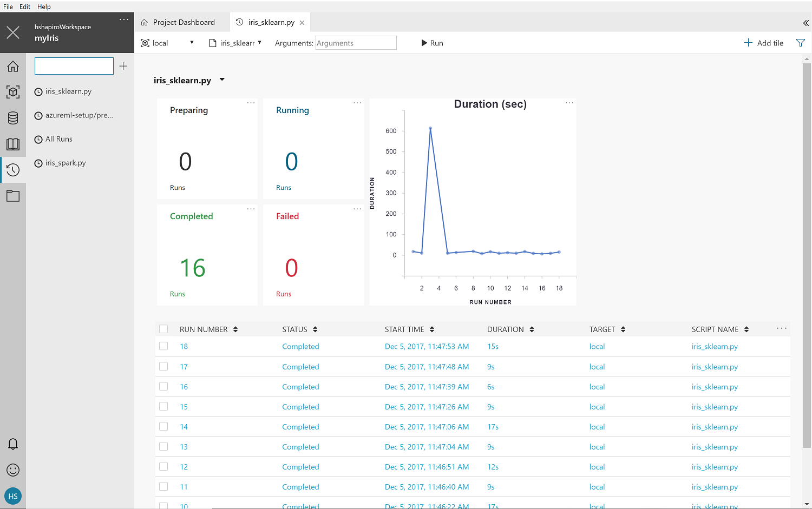
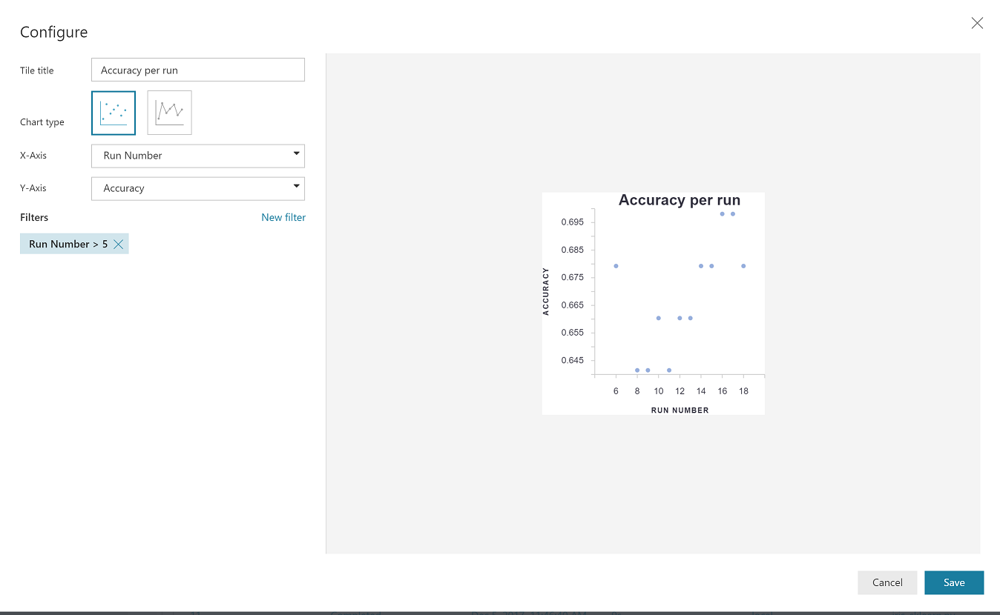
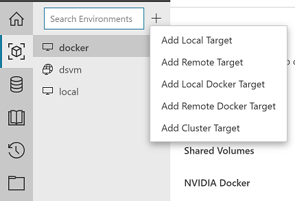

# Azure Machine Learning service release notes

In this article, learn about the Azure Machine Learning service releases. 

## 2018-12-04: General Availability

Azure Machine Learning service is now generally available.

### Azure Machine Learning Compute
With this release, we are announcing a new managed compute experience through the [Azure Machine Learning Compute](how-to-set-up-training-targets.md#amlcompute). This compute target replaces Azure Batch AI compute for Azure Machine Learning. 

This compute target:
+ Is used for model training and batch inferencing
+ Is single- to multi-node compute
+ Does the cluster management and job scheduling for the user
+ Autoscales by default
+ Support for both CPU and GPU resources 
+ Enables use of low-priority VMs for reduced cost

Azure Machine Learning Compute can be created in Python, using Azure portal, or the CLI. It must be created in the region of your workspace, and cannot be attached to any other workspace. This compute target uses a Docker container for your run, and packages your dependencies to replicate the same environment across all your nodes.

> [!Warning]
> We recommend creating a new workspace to use Azure Machine Learning Compute. There is a remote chance that users trying to create Azure Machine Learning Compute from an existing workspace might see an error. Existing compute in your workspace should continue to work unaffected.

### Azure Machine Learning SDK for Python v1.0.2
+ **Breaking changes**
  + With this release, we are removing support for creating a VM from Azure Machine Learning. You can still attach an existing cloud VM or a remote on-premises server. 
  + We are also removing support for BatchAI, all of which should be supported through Azure Machine Learning Compute now.

+ **New**
  + For machine learning pipelines:
    + [EstimatorStep](https://docs.microsoft.com/python/api/azureml-pipeline-steps/azureml.pipeline.steps.estimator_step.estimatorstep?view=azure-ml-py)
    + [HyperDriveStep](https://docs.microsoft.com/python/api/azureml-pipeline-steps/azureml.pipeline.steps.hyper_drive_step.hyperdrivestep?view=azure-ml-py)
    + [MpiStep](https://docs.microsoft.com/python/api/azureml-pipeline-steps/azureml.pipeline.steps.mpi_step.mpistep?view=azure-ml-py)


+ **Updated**
  + For machine learning pipelines:
    + [DatabricksStep](https://docs.microsoft.com/python/api/azureml-pipeline-steps/azureml.pipeline.steps.databricks_step.databricksstep?view=azure-ml-py) now accepts runconfig
    + [DataTransferStep](https://docs.microsoft.com/python/api/azureml-pipeline-steps/azureml.pipeline.steps.data_transfer_step.datatransferstep?view=azure-ml-py) now copies to and from a SQL datasource
    + Schedule functionality in SDK to create and update schedules for running published pipelines

<!--+ **Bugs fixed**-->

### Azure Machine Learning Data Prep SDK v0.5.2
+ **Breaking changes** 
  * `SummaryFunction.N` was renamed to `SummaryFunction.Count`.
  
+ **Bug Fixes**
  * Use latest AML Run Token when reading from and writing to datastores on remote runs. Previously, if the AML Run Token is updated in Python, the Data Prep runtime will not be updated with the updated AML Run Token.
  * Additional clearer error messages
  * to_spark_dataframe() will no longer crash when Spark uses `Kryo` serialization
  * Value Count Inspector can now show more than 1000 unique values
  * Random Split no longer fails if the original Dataflow doesn’t have a name  

+ **More information**
  * [Azure Machine Learning Data Prep SDK](https://aka.ms/data-prep-sdk)

### Docs and notebooks
+ ML Pipelines
  + New and updated notebooks for getting started with pipelines, batch scoping,  and style transfer examples: https://aka.ms/aml-pipeline-notebooks
  + Learn how to [create your first pipeline](how-to-create-your-first-pipeline.md)
  + Learn how to [run batch predictions using pipelines](how-to-run-batch-predictions.md)
+ Azure Machine Learning compute target
  + [Sample notebooks] (https://aka.ms/aml-notebooks) are now updated to use the new managed compute.
  + [Learn about this compute](how-to-set-up-training-targets.md#amlcompute)

### Azure portal: new features
+ Create and manage [Azure Machine Learning Compute](how-to-set-up-training-targets.md#amlcompute) types in the portal.
+ Monitor quota usage and [request quota](how-to-manage-quotas.md) for Azure Machine Learning Compute.
+ View Azure Machine Learning Compute cluster status in real time.
+ Virtual network support was added for Azure Machine Learning Compute and Azure Kubernetes Service creation.
+ Rerun your published pipelines with existing parameters.
+ New [automated machine learning charts](how-to-track-experiments.md#auto) for classification models (lift, gains, calibration, feature importance chart with model explainability) and regression models (residuals and feature importance chart with model explainability). 
+ Pipelines can be viewed in Azure portal


## 2018-11-20

### Azure Machine Learning SDK for Python v0.1.80

+ **Breaking changes** 
  * *azureml.train.widgets* namespace has moved to *azureml.widgets*.
  * *azureml.core.compute.AmlCompute* deprecates the following classes - *azureml.core.compute.BatchAICompute* and *azureml.core.compute.DSVMCompute*. The latter class will be removed in subsequent releases. The AmlCompute class has an easier definition now, and simply needs a vm_size and the max_nodes, and will automatically scale your cluster from 0 to the max_nodes when a job is submitted. Our [sample notebooks] (https://github.com/Azure/MachineLearningNotebooks/tree/master/training) have been updated with this information and should give you usage examples. We hope you like this simplification and lots of more exciting features to come in a later release!

### Azure Machine Learning Data Prep SDK v0.5.1 

Learn more about the Data Prep SDK by reading [reference docs](https://aka.ms/data-prep-sdk).
+ **New Features**
   * Created a new DataPrep CLI to execute DataPrep packages and view the data profile for a dataset or dataflow
   * Redesigned SetColumnType API to improve usability
   * Renamed smart_read_file to auto_read_file
   * Now includes skew and kurtosis in the Data Profile
   * Can sample with stratified sampling
   * Can read from zip files that contain CSV files
   * Can split datasets row-wise with Random Split (for example, into test-train sets)
   * Can get all the column data types from a dataflow or a data profile by calling `.dtypes`
   * Can get the row count from a dataflow or a data profile by calling `.row_count`

+ **Bug Fixes**
   * Fixed long to double conversion 
   * Fixed assert after any add column 
   * Fixed an issue with FuzzyGrouping, where it would not detect groups in some cases
   * Fixed sort function to respect multi-column sort order
   * Fixed and/or expressions to be similar to how `pandas` handles them
   * Fixed reading from dbfs path
   * Made error messages more understandable 
   * Now no longer fails when reading on remote compute target using AML token
   * Now no longer fails on Linux DSVM
   * Now no longer crashes when non-string values are in string predicates
   * Now handles assertion errors when Dataflow should fail correctly
   * Now supports dbutils mounted storage locations on Azure Databricks

## 2018-11-05

### Azure portal 
The Azure portal for the Azure Machine Learning service has the following updates:
  * A new **Pipelines** tab for published pipelines.
  * Added support for attaching an existing HDInsight cluster as a compute target.

### Azure Machine Learning SDK for Python v0.1.74

+ **Breaking changes** 
  * *Workspace.compute_targets, datastores, experiments, images, models, and *webservices* are properties instead of methods. For example, replace *Workspace.compute_targets()* with *Workspace.compute_targets*.
  * *Run.get_context* deprecates *Run.get_submitted_run*. The latter method will be removed in subsequent releases.
  * *PipelineData* class now expects a datastore object as a parameter rather than datastore_name. Similarly, *Pipeline* accepts default_datastore rather than default_datastore_name.

+ **New features**
  * The Azure Machine Learning Pipelines [sample notebook](https://github.com/Azure/MachineLearningNotebooks/tree/master/pipeline/pipeline-mpi-batch-prediction.ipynb) now uses MPI steps.
  * The RunDetails widget for Jupyter notebooks is updated to show a visualization of the pipeline.

### Azure Machine Learning Data Prep SDK v0.4.0 
 
+ **New features**
  * Type Count added to Data Profile 
  * Value Count and Histogram is now available
  * More percentiles in Data Profile
  * The Median is available in Summarize
  * Python 3.7 is now supported
  * When you save a dataflow that contains datastores to a DataPrep package, the datastore information will be persisted as part of the DataPrep package
  * Writing to datastore is now supported 
		
+ **Bug fixed**
  * 64-bit unsigned integer overflows are now handled properly on Linux
  * Fixed incorrect text label for plain text files in smart_read
  * String column type now shows up in metrics view
  * Type count now is fixed to show ValueKinds mapped to single FieldType instead of individual ones
  * Write_to_csv no longer fails when path is provided as a string
  * When using Replace, leaving “find” blank will no longer fail 

## 2018-10-12

### Azure Machine Learning SDK for Python v0.1.68

+ **New features**
  * Multi-tenant support when creating new workspace.

+ **Bugs fixed**
  * You no longer need to pin the pynacl library version when deploying web service.

### Azure Machine Learning Data Prep SDK v0.3.0

+ **New features**
  * Added method transform_partition_with_file(script_path), which allows users to pass in the path of a Python file to execute

## 2018-10-01

### Azure Machine Learning SDK for Python v0.1.65
[Version 0.1.65](https://pypi.org/project/azureml-sdk/0.1.65) includes new features, more documentation, bug fixes, and more [sample notebooks](https://aka.ms/aml-notebooks).

See [the list of known issues](resource-known-issues.md) to learn about known bugs and workarounds.

+ **Breaking changes**
  * Workspace.experiments, Workspace.models, Workspace.compute_targets, Workspace.images, Workspace.web_services return dictionary, previously returned list. See [azureml.core.Workspace](https://docs.microsoft.com/python/api/azureml-core/azureml.core.workspace(class)?view=azure-ml-py) API documentation.

  * Automated Machine Learning removed normalized mean square error from the primary metrics.

+ **HyperDrive**
  * Various HyperDrive bug fixes for Bayesian, Performance improvements for get Metrics calls. 
  * Tensorflow 1.10 upgrade from 1.9 
  * Docker image optimization for cold start. 
  * Jobs now report correct status even if they exit with error code other than 0. 
  * RunConfig attribute validation in SDK. 
  * HyperDrive run object supports cancel similar to a regular run: no need to pass any parameters. 
  * Widget improvements for maintaining state of drop-down values for distributed runs and HyperDrive runs. 
  * TensorBoard and other log files support fixed for Parameter server. 
  * Intel(R) MPI support on service side. 
  * Bugfix to parameter tuning for distributed run fix during validation in BatchAI. 
  * Context Manager now identifies the primary instance. 

+ **Azure portal experience**
  * log_table() and log_row() are supported in Run details. 
  * Automatically create graphs for tables and rows with 1, 2 or 3 numerical columns and an optional categorical column.

+ **Automated Machine Learning**
  * Improved error handling and documentation 
  * Fixed run property retrieval performance issues. 
  * Fixed continue run issue. 
  * Fixed ensembling iteration issues.
  * Fixed training hanging bug on MAC OS.
  * Downsampling macro average PR/ROC curve in custom validation scenario.
  * Removed extra index logic.
  * Removed filter from get_output API.

+ **Pipelines**
  * Added a method Pipeline.publish() to publish a pipeline directly, without requiring an execution run first.   
  * Added a method PipelineRun.get_pipeline_runs() to fetch the pipeline runs that were generated from a published pipeline.

+ **Project Brainwave**
  * Updated support for new AI models available on FPGAs.

### Azure Machine Learning Data Prep SDK v0.2.0
[Version 0.2.0](https://pypi.org/project/azureml-dataprep/0.2.0/) includes following features and bug fixes:

+ **New features**
  * Support for one-hot encoding
  * Support for quantile transform
   
+ **Bug fixed:**
  * Works with any Tornado version, no need to downgrade your Tornado version
  * Value counts for all values, not just the top three

## 2018-09 (Public preview refresh)

A new, refreshed release of Azure Machine Learning: Read more about this release: https://azure.microsoft.com/blog/what-s-new-in-azure-machine-learning-service/

## Older notes: Sept 2017 - Jun 2018
### 2018-05 (Sprint 5)

With this release of Azure Machine Learning, you can:
+ Featurize images with a quantized version of ResNet 50, train a classifier based on those features, and [deploy that model to an FPGA on Azure](../service/how-to-deploy-fpga-web-service.md) for ultra-low latency inferencing.

+ Quickly build and deploy highly accurate machine learning and deep learning models using [custom Azure Machine Learning Packages](../desktop-workbench/reference-python-package-overview.md)

### 2018-03 (Sprint 4)
**Version number**: 0.1.1801.24353  &nbsp;&nbsp;&nbsp;&nbsp;&nbsp;([Find your version](../desktop-workbench/known-issues-and-troubleshooting-guide.md#find-the-workbench-build-number))

Many of the following updates are made as direct results of your feedback. Keep them coming!

**Notable New Features and Changes**

- Support for running your scripts on remote Ubuntu VMs natively on your own environment in addition to remote-docker based execution.
- New environment experience in Workbench App allows you to create compute targets and run configurations in addition to our CLI-based experience.

- Customizable Run History reports


**Detailed Updates**

Following is a list of detailed updates in each component area of Azure Machine Learning in this sprint.

#### Workbench UI
- Customizable Run History reports
  - Improved chart configuration for Run History reports
    - The used entry points can be changed
    - Top-level filters can be added and modified
    
    - Charts and stats can be added or modified (and drag-and-drop rearranged).
    

  - CRUD for Run History reports
  - Moved all existing run history list view configuration files to server-side report, which acts like pipelines on runs from the selected entry points.

- Environments Tab
  - Easily add new compute target and run configuration files to your project
  
  - Manage and update your configuration files using a simple, form-based UX
  - New button for preparing your environments for execution

- Performance improvements to the list of files in the sidebar

#### Data preparation 
- Azure Machine Learning Workbench now allows you to be able to search for a column by using a known column's name.


#### Experimentation
- Azure Machine Learning Workbench now supports running your scripts natively on your own python or pyspark environment. For this capability, user creates and manages their own environment on the remote VM and use Azure Machine Learning Workbench to run their scripts on that target. See [Configuring Azure Machine Learning Experimentation Service](../desktop-workbench/experimentation-service-configuration.md) 

#### Model Management
- Support for Customizing the Deployed Containers: enables customizing the container image by allowing installation of external libraries using apt-get, etc. It is no longer limited to pip-installable libraries. See the [documentation](../desktop-workbench/model-management-custom-container.md) for more info.
  - Use the `--docker-file myDockerStepsFilename` flag and file name with the manifest, image, or service creation commands.
  - The base image is Ubuntu, and cannot be modified.
  - Example command: 
  
    ```shell
    $ az ml image create -n myimage -m mymodel.pkl -f score.py --docker-file mydockerstepsfile
    ```

### 2018-01 (Sprint 3) 
**Version number**: 0.1.1712.18263  &nbsp;&nbsp;&nbsp;&nbsp;&nbsp;([Find your version](../desktop-workbench/known-issues-and-troubleshooting-guide.md#find-the-workbench-build-number))

The following are the updates and improvements in this sprint. Many of these updates are made as direct result of user feedback. 

### 2017-12 (Sprint 2)
**Version number**: 0.1.1711.15263  &nbsp;&nbsp;&nbsp;&nbsp;&nbsp;([Find your version](../desktop-workbench/known-issues-and-troubleshooting-guide.md#find-the-workbench-build-number))

This release is the third update of Azure Machine Learning. This update includes improvements in the workbench app, the Command-line Interface (CLI), and the back-end services. Thank you very much for sending the smiles and frowns. Many of the following updates are made as direct results of your feedback. 

### 2017-11 (Sprint 1) 
**Version number**: 0.1.1710.31013  &nbsp;&nbsp;&nbsp;&nbsp;&nbsp;([Find your version](../desktop-workbench/known-issues-and-troubleshooting-guide.md#find-the-workbench-build-number))

In this release, we've made improvements around security, stability, and maintainability in the workbench app, the CLI, and the back-end services layer. 

### 2017-10 (Sprint 0) 
**Version number**: 0.1.1710.31013  &nbsp;&nbsp;&nbsp;&nbsp;&nbsp;([Find your version](../desktop-workbench/known-issues-and-troubleshooting-guide.md#find-the-workbench-build-number))

This release is the first update of Azure Machine Learning Workbench following our initial public preview at the Microsoft Ignite 2017 conference. The main updates in this release are reliability and stabilization fixes. 

## Next steps

Read the overview for [Azure Machine Learning](../service/overview-what-is-azure-ml.md).
