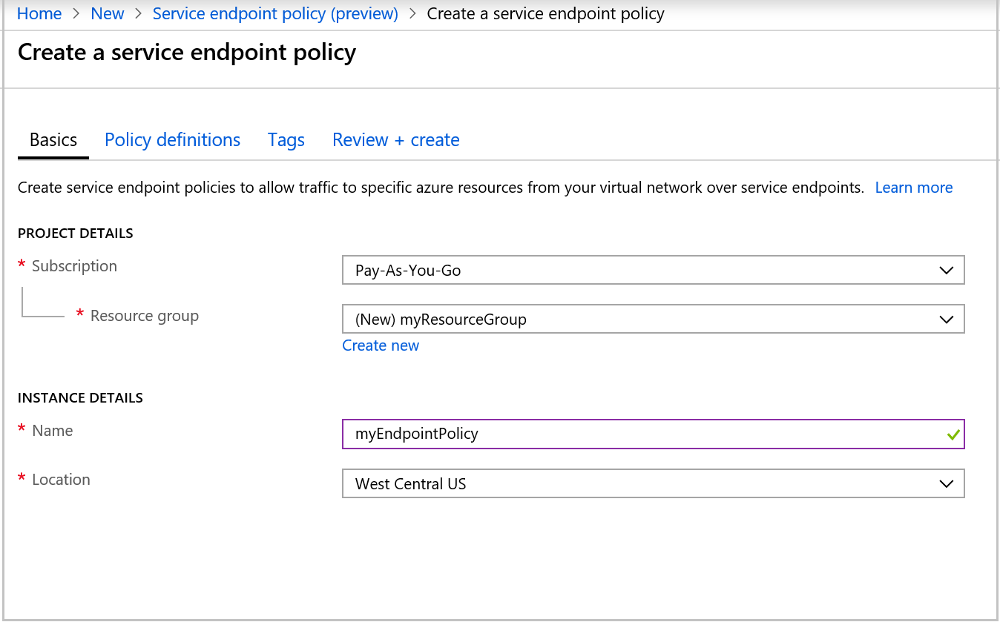
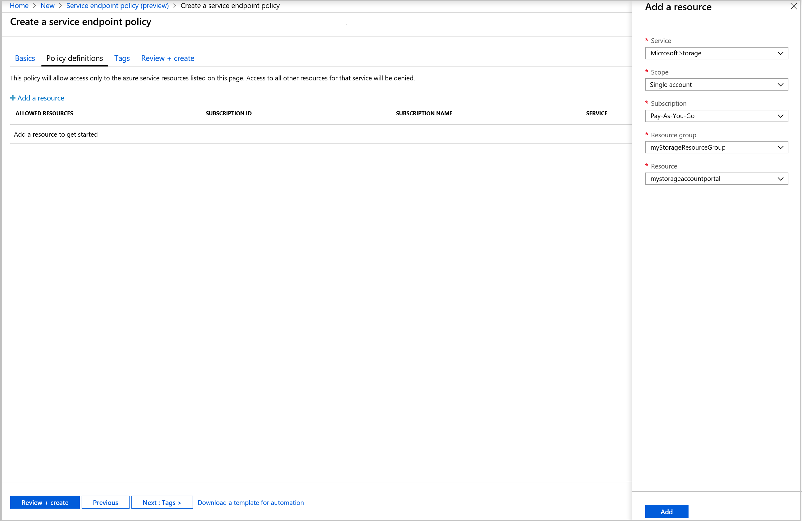
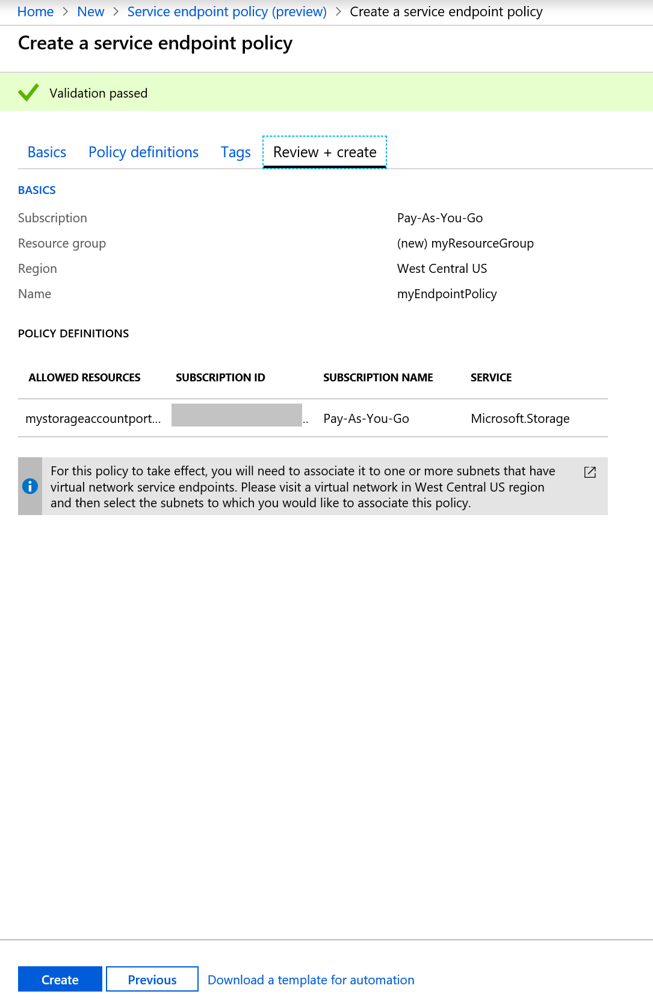
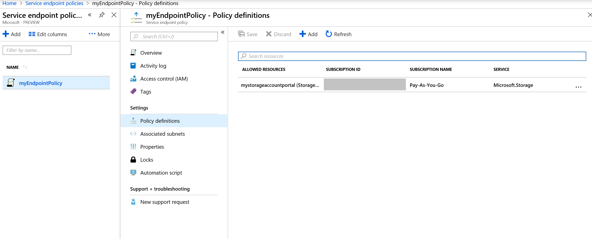
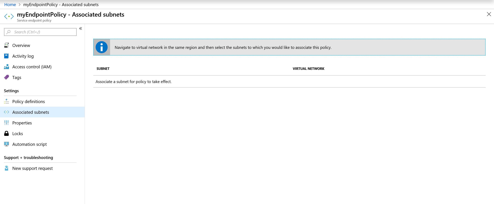
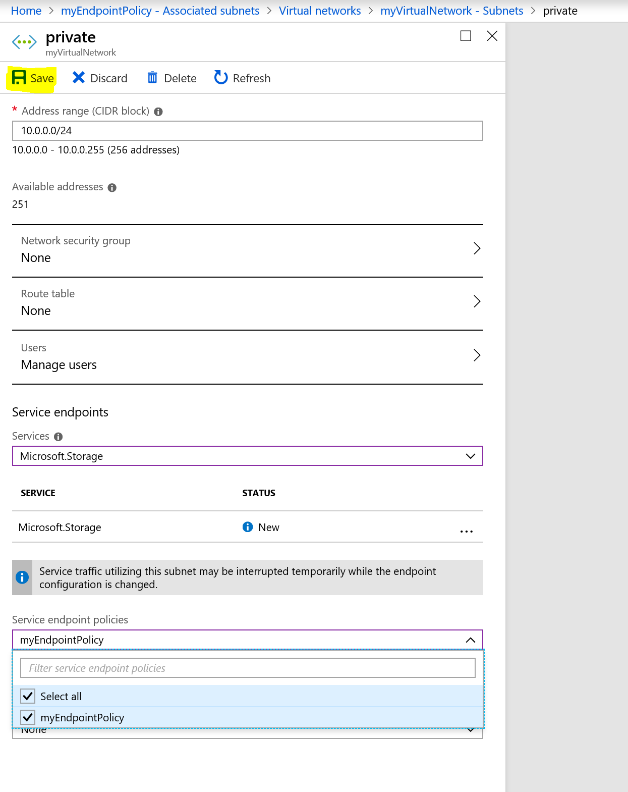

# Create, change, or delete service endpoint policy using the Azure portal

Service endpoint policies enable you to filter virtual network traffic to specific Azure resources, over service endpoints. If you're not familiar with service endpoint policies, see [service endpoint policies overview](virtual-network-service-endpoint-policies-overview.md) to learn more.

 In this tutorial, you learn how to:

> [!div class="checklist"]
> * Create a service endpoint policy
> * Create a service endpoint policy definition
> * Create a virtual network with a subnet
> * Associate a service endpoint policy to a subnet

If you don't have an Azure subscription, create a [free account](https://azure.microsoft.com/free/?WT.mc_id=A261C142F) before you begin.

## Sign in to Azure 

Sign in to the Azure portal at http://portal.azure.com.

## Create a service endpoint policy

1. Select **+ Create a resource** on the upper, left corner of the Azure portal.
2. In search pane, type "service endpoint policy" and select **Service endpoint policy (Preview)** and then select **Create**.
3. Enter, or select, the following information in **Basics** 

   - Subscription   : Select your subscription for policy.    
   - Resource group : Select **Create new** and enter *myResourceGroup*.     
   - Name           : myEndpointPolicy
   - Location       : West Central US     
 
   
   
4. Enter, or select, the following information in **Policy Definitions**

   - Click **+ Add a resource**,  enter, or select, the following information, accept the default for the remaining settings and click **Add**.  
   - Scope          : Select **Single Account** or **All accounts in  subscription** or **All accounts in resource group**.    
   - Subscription   : Select your subscription for storage account. Policy and storage accounts can be in different subscriptions.   
   - Resource group : Select your resource group. Required, if  scope is set as, "All accounts in resource group" or "Single account".  
   - Resource       : mystorageaccountportal    
   - Click **+ Add a resource** to continue adding more resources.
   
   
   
5. Optional: Enter or select, the following information in **Tags**:
   
   - Key     : Select your key for the policy. Ex: Dept     
   - Value   : Enter value pair for the key. Ex: Finance

6. Select **Review + Create**. Validate the information and Click **Create**. To make further edits, click **Previous**. 

   
  
 
## View endpoint policies 

1. In the *All services* box in the portal, begin typing *service endpoint policies*. Select **Service Endpoint Policies(Preview)**.
2. Under **Subscriptions**, select your subscription and resource group, as shown in the following picture

   
       
3. Select the policy and click on **Policy Definitions** to view or add more policy definitions.

   

4. Select **Associated subnets** to view the subnets the policy is associated. To associate policy to a subnet, click on "Navigate to virtual network in the same region".

   
 
## Associate a policy to a subnet

>[!WARNING] 
> Ensure that all the resources accessed from the subnet, for the selected service, are added to the policy before associating the policy. Once the policy is associated, only access to the resources listed in the policy will be allowed, for endpoint regions for the service. 

Before you can associate a policy to a subnet, you have to create a virtual network and subnet, then you can associate the policy to the subnet:

1. Select **+ Create a resource** on the upper, left corner of the Azure portal.
2. Select **Networking**, and then select **Virtual network**.
3. Under **Create virtual network**, Enter, or select, the following information, accept the default for the remaining settings, and then select **Create**:
   - Name           : myVirtualNetwork      
   - Address space  : 10.0.0.0/16      
   - Subscription   : Select your subscription. Policy should be in the same subscription as the VNet     
   - Resource group : Select **Use existing** and then select *myResourceGroup*     
   - Location       : West Central US     
   - Subnet name    : private     
   - Address range  : 10.0.0.0/24
     
4. In the **Search resources, services, and docs** box at the top of the portal, begin typing *myVirtualNetwork*. When **myVirtualNetwork** appears in the search results, select it.
5. Under **SETTINGS**, select **Subnets** and then select **private**.
6. As shown in the following picture, select **Service endpoints**, select **Microsoft.Storage**, select **Service endpoint policies**, select **myEndpointPolicy**, and then select **Save**:

   

>[!WARNING] 
>Access to service resources in other regions will be allowed from this subnet, based on Network Security Groups (NSGs). To restrict access to only endpoint regions, limit NSGs to only service traffic in endpoint regions. For more information on how to create NSGs with service tags per region, see [NSG Azure service tags.](manage-network-security-group.md?toc=%2fcreate-a-security-rule%2f.json)

In the example below, NSG is restricted to access only Azure Storage resources in WestCentralUS and WestUS2, with a "Deny all" rule as a lower-priority rule.

## Next steps
In this tutorial, you created a service endpoint policy and associated it to a subnet. To learn more about service endpoint policies, see [service endpoint policies overview.](virtual-network-service-endpoint-policies-overview.md)

